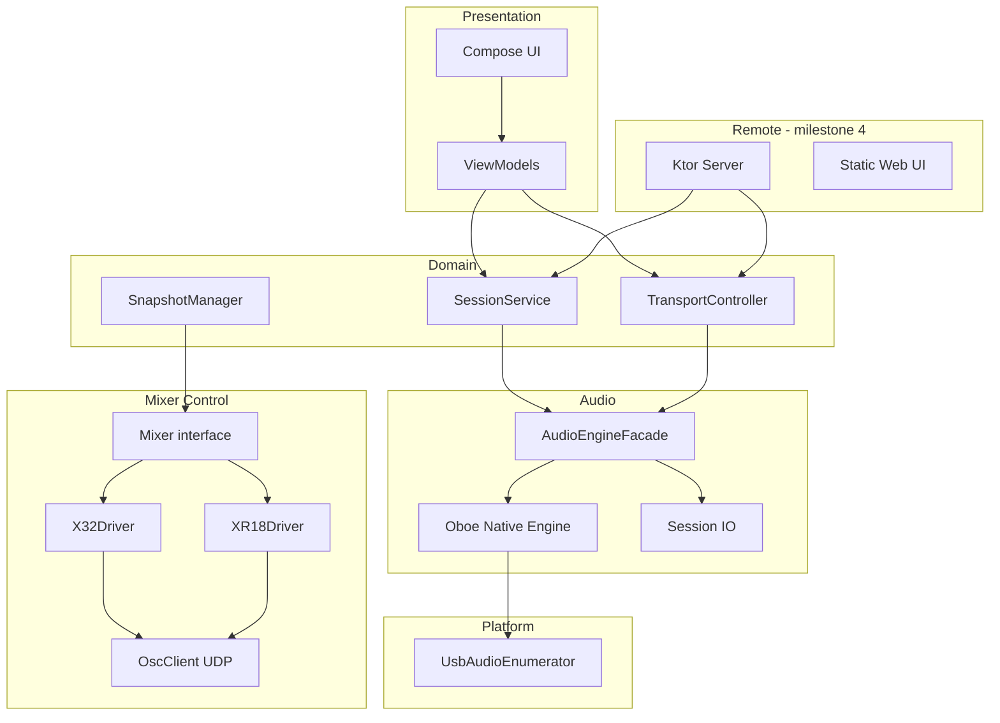

# OpenMultiTrack — System Architecture

> **Agent onboarding:** [AGENTS.md](AGENTS.md) · **Feature status:** [PROJECT_STATUS.md](PROJECT_STATUS.md)

## Purpose

OpenMultiTrack records multichannel audio from Behringer/Midas USB mixers and plays sessions back for virtual soundchecks, with OSC-based routing control and an on-device web remote.

## License choice: GPLv3

We use **GNU GPLv3** (not AGPLv3) because:

- The complete application (native engine, Kotlin layers, bundled web assets) is **distributed as a single APK** via F-Droid; GPLv3 already requires corresponding source for recipients of the binary.
- Dependencies are overwhelmingly **Apache-2.0 / MIT / BSD**; GPLv3 is the standard copyleft layer for Android apps in F-Droid.
- AGPLv3’s “network use” clause mainly matters when operators run **modified server-only** deployments without distributing binaries. Our embedded NanoHTTPD/Ktor UI is **part of the distributed app**, not a separate hosted service.

If we later split the control server into a separately deployed network appliance, revisit AGPLv3 for that component.

## Layered architecture

```
┌─────────────────────────────────────────────────────────────────────────┐
│  Presentation (Jetpack Compose, MVVM)                                   │
│  app module — Activities, ViewModels, navigation                        │
└───────────────────────────────┬─────────────────────────────────────────┘
                                │
┌───────────────────────────────▼─────────────────────────────────────────┐
│  Remote / Control API (Ktor CIO + WebSocket) — milestone 4              │
│  remote-server module — REST + WS; shared by web UI & future clients    │
└───────────────────────────────┬─────────────────────────────────────────┘
                                │
┌───────────────────────────────▼─────────────────────────────────────────┐
│  Application / Session domain (pure Kotlin)                             │
│  domain module — Session, Transport, Snapshot, RecordingLayout          │
└───────┬───────────────────────────────┬─────────────────────────────────┘
        │                               │
┌───────▼──────────┐            ┌───────▼──────────────────────────────────┐
│  Mixer control   │            │  Session I/O (WAV/BWF, FLAC opt.)          │
│  mixer-behringer │            │  session-io module — milestone 2           │
│  Mixer interface │            │  off audio thread; chunked writes          │
│  OSC UDP         │            └───────┬────────────────────────────────────┘
└───────┬──────────┘                    │
        │                    ┌──────────▼────────────────────────────────────┐
        │                    │  Audio engine facade (Kotlin JNI)             │
        │                    │  audio-engine module                          │
        │                    └──────────┬────────────────────────────────────┘
        │                               │
        │                    ┌──────────▼────────────────────────────────────┐
        │                    │  Native real-time engine (C++17, Oboe)        │
        │                    │  Ring buffers, transport clock, meter taps    │
        │                    └──────────┬────────────────────────────────────┘
        │                               │
┌───────▼───────────────────────────────▼────────────────────────────────────┐
│  Platform USB / device layer                                               │
│  usb-audio module — enumeration, permissions, channel probe                │
└────────────────────────────────────────────────────────────────────────────┘
```

### Boundary justifications

| Boundary | Why |
|----------|-----|
| **Native audio engine** | Sub-10 ms deadlines; no GC, no locks on callback thread; Oboe/AAudio is C++. |
| **Kotlin domain** | Testable session/transport rules without JNI; drives UI and remote API. |
| **Mixer drivers** | OSC vocabulary differs by model; audio path is identical UAC2. |
| **Session I/O** | Disk throughput and WAV chunking are not real-time; SPSC queues from engine. |
| **Remote API** | Same `ControlService` interface for Compose and web; no duplicated business logic. |

## Data flows

### Record path

```
Mixer ADC → USB UAC2 IN (clock master)
    → Oboe input callback (deviceId = USB audio device)
    → de-interleave / per-track tap (optional)
    → SPSC ring buffer per writer lane
    → writer thread(s) → WAV (per-track and/or interleaved RF64 if >4GB)
    → domain: session position += framesWritten
```

- **Clock**: USB sync — we do **not** resample on record; frame count is authoritative.
- **Sync guarantee**: single input stream (interleaved) or one clock domain; per-track files share `sessionFrameIndex` origin and BWF `codingHistory` timestamp.

### Playback / seek path

```
Disk reader thread(s) → ring buffers (prefetch)
    → Oboe output callback (USB play)
    → Mixer USB returns → OSC-routed channel inputs
```

**Seek algorithm (sample-aligned):**

1. Transport receives target frame `T` (from UI/WS).
2. Signal **flush** to engine; output callback outputs silence until flush ACK.
3. Reader threads **seek** all active tracks to byte offset `T * bytesPerFrame` (WAV) using pre-built index if present (see risks doc).
4. Prefetch `N` ms (configurable, default 200 ms) into rings.
5. Resume output at frame `T`; all tracks share `transportFrame = T`.

Scrubbing uses the same path with coalesced seek targets (latest wins per 50 ms window).

### Control path (OSC)

```
UI / Web → ControlService → Mixer.snapshotRecall(id)
    → OscClient (UDP) → mixer firmware
    ← OSC /xinfo, /ch/** confirmations
```

Snapshots bundle routing presets (record vs soundcheck). App verifies via subscribed feedback addresses (driver-specific).

## Threading and buffering model

| Thread | Work |
|--------|------|
| **Oboe callback** (high priority) | Copy in/out of lock-free SPSC rings only; no alloc, no I/O. |
| **Disk writer pool** | Drain record rings; WAV flush; backpressure → `XRUN` event. |
| **Disk reader pool** | Fill playback rings; handles seek commands. |
| **Control / OSC** | UDP send/receive; not on audio threads. |
| **Main / Compose** | UI state; collects `StateFlow` from domain. |

**Ring buffer sizing**: `capacityFrames = max(4 * burstSize, sampleRate * 0.1)` per direction, tune on hardware.

## MVVM (presentation)

- `MainViewModel` → `UsbAudioProbeUiState`
- Future: `SessionViewModel`, `TransportViewModel` observing `SessionRepository` and `ControlService`.

## Module map (repository)

| Module | Responsibility |
|--------|----------------|
| `app` | Application, Compose, DI wiring, USB permission UX |
| `domain` | Entities, `Mixer`, `Transport`, repository interfaces |
| `usb-audio` | USB enumeration, Behringer heuristics, JNI bridge to probe |
| `audio-engine` | Native Oboe engine + Kotlin facade |
| `mixer-behringer` | `X32Mixer`, `Xr18Mixer` OSC |
| `session-io` | WAV/BWF writer/reader (milestone 2) |
| `remote-server` | Ktor HTTP/WS (milestone 4) |

## Dependency licenses (F-Droid compatible)

| Library | License | Use |
|---------|---------|-----|
| AndroidX / Compose | Apache-2.0 | UI |
| Kotlin / Coroutines | Apache-2.0 | async |
| Oboe | Apache-2.0 | native audio I/O |
| Ktor (planned) | Apache-2.0 | embedded server |
| kotlinx-serialization | Apache-2.0 | API JSON |
| NanoHTTPD (alt.) | BSD-3 | not used if Ktor chosen |

**Excluded**: Play Services, Firebase, Crashlytics, proprietary USB SDKs, analytics.

## Control API (summary)

Full OpenAPI-style doc: [`control-api.md`](control-api.md). Milestone 4 implements endpoints; domain interfaces exist from milestone 2 onward.

## Milestones

1. **Now**: USB enumerate + Oboe channel probe UI (vertical slice).
2. Record 2ch → WAV; expand to full channel count.
3. Multitrack playback + sample-aligned seek + markers/loop.
4. OSC snapshots (record ↔ soundcheck).
5. Ktor web UI + WebSocket meters/transport.

## Component diagram (Mermaid)


