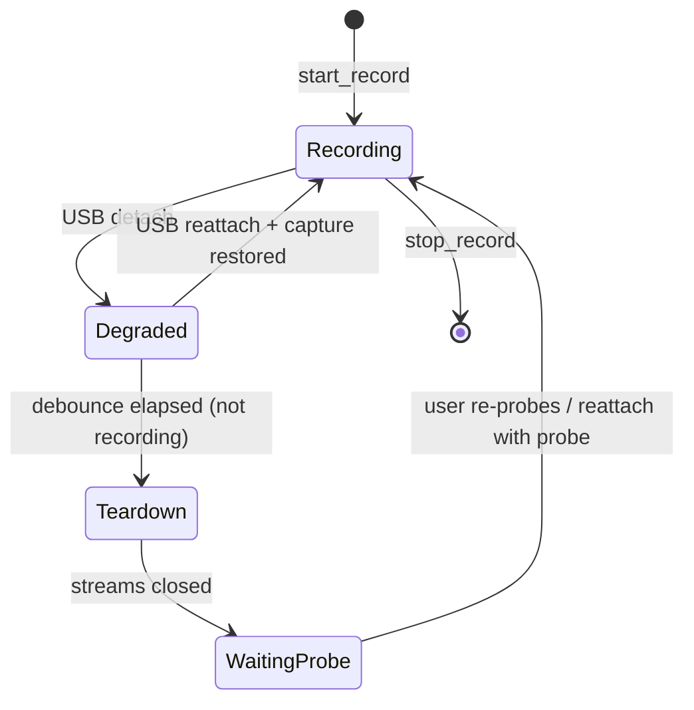
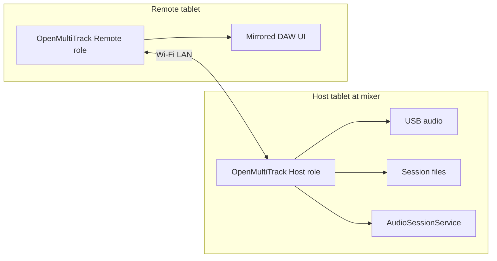
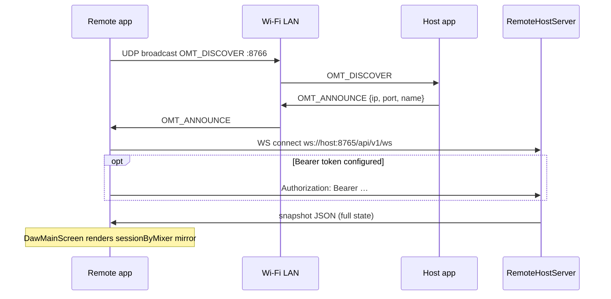
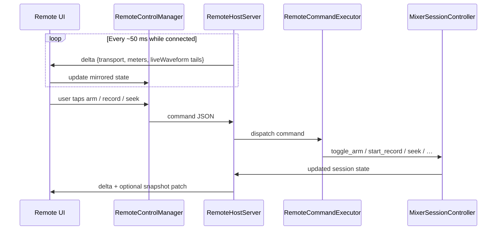

# Operational flows

Sequence-level views of two critical runtime behaviors: **USB dropout recovery during recording** and **LAN remote sync**. These complement the pipeline descriptions in [data-flows.md](data-flows.md).

Implementation anchors (for navigation, not line numbers):

| Flow | Primary types |
|------|----------------|
| USB dropout | `MixerSessionController`, `CaptureSessionEngine`, `IncompleteRecordingStore` |
| LAN remote | `RemoteControlManager`, `RemoteHostServer`, `RemoteClient`, `RemoteCommandExecutor` |

---

## USB dropout recovery (recording)

Goal: keep the session **alive and timeline-aligned** when the mixer briefly disconnects. Gaps become **silence in the WAV files**, not missing frames or a crash.

### State machine (simplified)



### Sequence: detach → silence → reattach

```mermaid
sequenceDiagram
    participant USB as Android USB stack
    participant VM as MainViewModel
    participant MSC as MixerSessionController
    participant CE as CaptureSessionEngine
    participant IO as PerChannelWavWriter
    participant Meta as session.json

    Note over USB,Meta: Normal recording
    CE->>IO: PCM frames (armed channels)
    CE->>Meta: timelineFramesWritten += N

    USB->>VM: DEVICE_DETACHED
    VM->>MSC: onUsbDetached(deviceName)
    MSC->>MSC: cancel pending debounce job
    alt Soundcheck was playing
        MSC->>MSC: stopSoundcheck()
    end
    MSC->>CE: setUsbDegraded(true)
    MSC->>MSC: UI warning + RECORDING_DEGRADED

    loop While degraded and recording
        CE->>CE: insertSilenceForTimelineGap()
        CE->>IO: zero PCM (keeps wall-clock alignment)
        CE->>Meta: timelineFramesWritten += silenceFrames
    end

    par Debounced teardown (if still degraded)
        MSC->>MSC: delay(usbDetachDebounceMs)
        alt Not recording
            MSC->>CE: stopCapture()
            MSC->>MSC: close usbStream
        else Still recording
            Note over MSC: Keep writers open; silence continues
        end
    end

    USB->>VM: DEVICE_ATTACHED
    VM->>MSC: onUsbAttached(descriptor)
    MSC->>MSC: cancel debounce job
    MSC->>MSC: ensureCapture(descriptor, cachedProbe)
    MSC->>CE: setUsbDegraded(false)
    MSC->>Meta: append to same sessionDir (incomplete=true)
    MSC->>MSC: UI "USB reconnected — recording resumed"
```

### Key behaviors

| Behavior | Detail |
|----------|--------|
| **Timeline authority** | `timelineFramesWritten` in `session.json` includes silence gaps so soundcheck duration matches real-world elapsed time |
| **Debounce** | `AppSettingsStore.usbDetachDebounceMs` (~400 ms default) before tearing down native capture when not recording |
| **Playback on detach** | Active soundcheck stops immediately to avoid underrun glitches |
| **Crash recovery** | `IncompleteRecordingStore` detects `incomplete: true` sessions on next launch and offers resume via `resumeRecording()` |
| **Session files** | Same `sessionDir`; writers append; no new timestamp folder mid-take |

### Tests

- `InterruptedRecordingPrepE2eTest`, `InterruptedRecordingResumeE2eTest` in `app/.../e2e/`
- Spec summary: [../product/roadmap.md](../product/roadmap.md#usb-dropout-behavior)

---

## LAN remote sync (Host / Remote)

Goal: a **second Android device** mirrors the Host DAW and sends commands. The Host retains USB, files, and the audio engine.

### Roles



### Discovery and connect



### Steady-state sync



### Waveform bandwidth

Heavy waveform data is **not** sent on every tick:

| Data | Strategy |
|------|----------|
| Live record tail | Quantized 8-bit peaks for last ~48 samples in delta |
| Soundcheck overview | Remote sends `waveform_request`; Host replies with `waveform_chunk` downsampled to `maxPoints` (default 400) |

Protocol constants: `domain/remote/RemoteProtocol.kt`  
Full message catalog: [../remote-control.md](../remote-control.md)

### Security and failure modes

| Topic | Behavior |
|-------|----------|
| **Trust model** | LAN-trusted cleartext by default |
| **Optional auth** | Host rejects WebSocket without bearer token when configured in settings |
| **Disconnect** | Remote shows banner; Host continues recording unaffected |
| **AP isolation** | Tablet-to-tablet discovery may fail; use `scripts/tcp-bridge.py` to relay ports 8765/8766 |

### Tests

- `RemoteE2eHostTest`, `RemoteE2eClientTest` — `scripts/run-dual-device-e2e-tests.sh`
- Unit: `RemoteJsonCodecTest`, `RemoteWaveformUtilTest`

---

## Related

- [data-flows.md](data-flows.md) — static pipeline diagrams
- [threading.md](threading.md) — real-time constraints
- [../remote-control.md](../remote-control.md) — command table
- [../modules/remote-server.md](../modules/remote-server.md) — wire format owners
