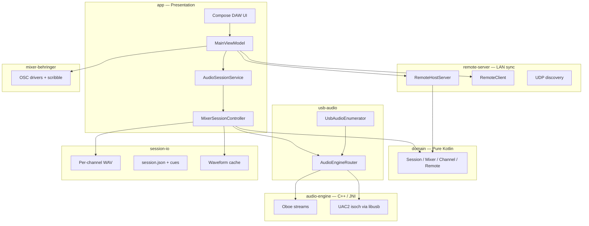

# System overview

OpenMultiTrack is a **FOSS Android application** for live multitrack recording and virtual soundcheck with Behringer/Midas USB mixers (X32, XR18, Flow 8, and other UAC2 devices). Audio flows over **USB Audio Class 2**; mixer routing control uses **OSC over UDP** where implemented.

## Primary capabilities

| Capability | Description |
|------------|-------------|
| **Multitrack record** | Capture probed USB input channels to per-channel 24-bit WAV files in a structured session directory |
| **Monitor** | Low-latency headphone/monitor output with per-channel solo and gain |
| **Virtual soundcheck** | Play back recorded sessions to USB outputs with transport, seek, loop regions, and waveforms |
| **Multi-mixer** | Manage several mixer profiles; one active at a time; shared USB capture with exclusive ownership rules |
| **LAN remote** | Second Android device mirrors Host UI state and sends commands (not a browser web app) |
| **Scribble strip** | Read channel labels/colors from OSC (XR18/X32) or BLE/USB (Flow 8) — read-only |

## High-level component diagram



## Layered architecture

```
┌─────────────────────────────────────────────────────────────────┐
│  Presentation — Jetpack Compose, MVVM (`app`)                   │
│  DAW UI, settings, foreground audio service                     │
└────────────────────────────┬────────────────────────────────────┘
                             │
┌────────────────────────────▼────────────────────────────────────┐
│  Remote sync (`remote-server` + `app/remote`)                   │
│  NanoHTTPD WebSocket host, OkHttp client, UDP discovery         │
└────────────────────────────┬────────────────────────────────────┘
                             │
┌────────────────────────────▼────────────────────────────────────┐
│  Application domain (`domain`) — pure Kotlin                    │
│  Session, transport, mixer profiles, channel strips, remote     │
└──────────┬──────────────────────────────┬─────────────────────────┘
           │                              │
┌──────────▼──────────┐         ┌─────────▼─────────────────────────┐
│  Mixer control      │         │  Session I/O (`session-io`)       │
│  `mixer-behringer`  │         │  WAV, metadata, waveform peaks    │
└──────────┬──────────┘         └─────────┬─────────────────────────┘
           │                              │
           │                  ┌───────────▼─────────────────────────┐
           │                  │  Audio facade (`audio-engine` JNI)  │
           │                  └───────────┬─────────────────────────┘
           │                              │
           │                  ┌───────────▼─────────────────────────┐
           │                  │  Native engine (C++17, Oboe, libusb)│
           │                  └───────────┬─────────────────────────┘
           │                              │
┌──────────▼──────────────────────────────▼─────────────────────────┐
│  USB / device layer (`usb-audio`)                                   │
│  Enumeration, permissions, Oboe vs UAC2 routing                   │
└───────────────────────────────────────────────────────────────────┘
```

## License: GPLv3

The project uses **GNU GPLv3-or-later** (not AGPLv3):

- The complete app (Kotlin, native engine, bundled assets) ships as a **single APK**; GPLv3 already requires corresponding source for binary recipients.
- Dependencies are overwhelmingly Apache-2.0 / MIT / BSD; GPLv3 is the standard copyleft layer for F-Droid Android apps.
- AGPLv3’s network-use clause mainly matters for separately hosted server deployments. The embedded LAN server is part of the distributed app.

See [decisions.md](decisions.md) for other fixed choices.

## What this is not

- **Not** a browser-based web remote (no embedded HTML/JS SPA for control; remote is a second Android app instance).
- **Not** dependent on Google Play Services, Firebase, or proprietary USB SDKs.
- **Not** a network audio (Dante/AES67) client — USB is the audio transport.

## Related docs

- [modules.md](modules.md) — module dependency graph
- [data-flows.md](data-flows.md) — record, playback, sync paths
- [threading.md](threading.md) — real-time constraints
- [../product/overview.md](../product/overview.md) — user-facing goals and modes
