# 06 — Channel Icons and Stereo Link

How the official *Behringer FLOW Mixer* app (`Flowmix_v1.9.apk`) stores and
retrieves **channel icon IDs** and **stereo-link state** over Bluetooth LE.

Icons are **not** embedded in channel names (unlike XR18/Mixing Station OSC
`_NN` suffixes). The resolved picture is a **Mixing Station scribble icon ID**
(1–74). Over BLE the mixer does **not** send that ID directly — it sends an
**input-type category** plus a **preset index** that the official app resolves
through `getInputChannelPresetIconIdAtIndex` in `libcom_musicgroup_xairbt.so`.
Flow Mix drawable assets are named `input_icon_{type×100+preset:03d}` (e.g.
`input_icon_004`, `input_icon_304`, `input_icon_507`).

The mixer always returns **six** names (see doc 04). Icons align with those six
strips; USB 9–10 use no mixer icon (Main L/R). Stereo linking applies only to the
hardware pairs **Ch5/6** and **Ch7/8** and affects internal routing, not how many
names are returned.

> **Sources:** `libcom_musicgroup_xairbt.so` symbols/strings from
> `Flowmix_v1.9.apk` (firmware **v11749**), plus hardware validation on a
> locally connected FLOW 8 (`FLOW 8 LE`, firmware bytes in HandshakeHost
> `…ee f4 01 00 09` → **v11749**). Captures are in
> [`tools/flow8_dump.bin`](./tools/flow8_dump.bin) (436 B) and
> [`tools/icon_config.bin`](./tools/icon_config.bin) (48 B).

---

## Overview: two BLE reads after handshake

After the standard handshake and `GetMixerState` (`0x37` → `0x38` fragments,
see doc 03), the official app performs a **second query** for icon data:

```
  Client                          FLOW 8
  ──────                          ──────
  … 0x37 GetMixerState  →
  ← 0x38 fragments (reassembled state buffer)
  … 0x26 ParamQuery id=0x80  →
  ← 0x25 ParamResponse id=0x80, 48-byte payload
```

The reassembled `0x38` buffer supplies the **six names** and per-strip **input
type** bytes. The `0x80` response supplies the **preset index** for each strip
(groups 0–5 of the 48-byte payload). **Both** are required to resolve the final
Mixing Station icon ID.

---

## Icon encoding — input type + preset

| Layer | Source | Meaning |
| ----- | ------ | ------- |
| Resolved icon | `getChannelIconId` / `Channel::getIconId` | Mixing Station ID **1–74** (stored at channel offset `+0x28`) |
| Input type | BLE `0x38` compact name record | Category 0–5 (mic / guitar / line / playback — see table below) |
| Preset index | ParamQuery `0x80`, byte 1 of each 4-byte group | Index into that category’s icon picker list |
| Flow drawable | APK `res/drawable` | `input_icon_{type×100+preset:03d}` |
| Native lookup | `getInputChannelPresetIconIdAtIndex(inputType, presetIndex)` | Maps `(type, preset)` → MS icon byte |

**Important:** the `0x80` preset byte alone is **not** the scribble icon. The same
preset value means different icons in different categories — e.g. preset `04`
is **Wired Mic** on a dynamic-mic strip (type 0) but **Violine** on a line-instrument
strip (type 3). Hardware capture `03 04` on both Ch1 and Ch4 demonstrates this.

### FLOW input types

| Type | Native constant | Flow Mix picker category | Drawable range (APK v1.9) |
| ---- | --------------- | ------------------------ | ------------------------- |
| 0 | `InputTypeDynamicMic` | Dynamic / wired mics | `input_icon_000` … `input_icon_014` (15) |
| 1 | `InputTypeCondensorMic` | Condenser mics | `input_icon_100` … `input_icon_110` (11) |
| 2 | `InputTypeGuitarOrBass` | Guitar / bass | `input_icon_200` … `input_icon_217` (18) |
| 3 | `InputTypeLineInstrument` | Line instruments | `input_icon_300` … `input_icon_317` (18) |
| 4 | *(extended guitar page)* | Additional guitar icons | `input_icon_400` … `input_icon_407` (8) |
| 5 | *(playback / source)* | Playback, record, USB, etc. | `input_icon_500` … `input_icon_511` (12) |

Types 4 and 5 are used on hardware but are not exposed as separate `InputType*`
JNI stubs in the v1.9 library (only 0–3 are). They appear in the BLE compact
name header and in the `input_icon_4xx` / `input_icon_5xx` drawable pages.

### Method A — ParamQuery `0x80` + MixerState input type (preferred)

Maps to native **GetSetting** (`XAIRBT_CMD_GET_SETTING`). The Flow Mix app
issues:

**Request**

```
frame(0x26, [0x80])
  = [0x26, 0x01, 0x80, 0xA7]
```

Checksum: `(0x26 + 0x01 + 0x80) & 0xFF = 0xA7`.

**Response** (`0x25` ParamResponse)

```
[0x25][0x01][param_id][payload_len][payload…][checksum]
```

- `param_id` = `0x80`
- `payload_len` = `0x30` (48 bytes) on hardware
- Payload layout: **12 groups × 4 bytes** (only groups **0–5** matter for input scribble)

| Offset (per group) | Field | Notes |
| ------------------ | ----- | ----- |
| `+0` | Marker | `0x03` = typed preset (current firmware); `0x00` = legacy plain encoding |
| `+1` | Preset index | Index into the strip’s input-type picker |
| `+2`, `+3` | Reserved | Always `0x00` in hardware captures |

| Group index | Strip | USB channels |
| ----------- | ----- | -------------- |
| 0–3 | Ch1–Ch4 | USB 1–4 |
| 4 | Ch5+6 | USB 5–6 |
| 5 | Ch7+8 | USB 7–8 |
| 6–11 | FX / other | *(not used for input scribble)* |

#### BLE compact name record — input type byte

After scanning the six `[len][ascii…]` names in the `0x38` buffer, read the
**input type** for each strip from the bytes **before** the length byte:

| Pattern | Input type |
| ------- | ---------- |
| `[…][0x6a][len][name]` | **0** (dynamic mic) — Ch1–3 on hardware |
| `[type][…][len][name]` where `type` ≤ 5 | **`type`** — byte at `name_offset − 3` |

Example hex around **Violine** (strip 4) in [`tools/flow8_dump.bin`](./tools/flow8_dump.bin):

```
… 03 01 34 07 56 69 6f 6c 69 6e 65 …
      ^^    ^^
      |     +-- len = 7
      +-- input type = 3 (line instrument)
```

#### Decode algorithm

```python
# See tools/flow8_icon_decode.py for the reference implementation.

def decode_icons(mixer_state: bytes, icon_payload: bytes) -> list[int]:
    name_offsets = scan_name_offsets(mixer_state)   # six [len][ascii] records
    icons = []
    for strip in range(6):
        base = strip * 4
        marker, preset = icon_payload[base], icon_payload[base + 1]
        if marker != 0x03:
            …  # legacy 0x00 marker — see tools/flow8_icon_decode.py
        input_type = decode_input_type(mixer_state, name_offsets[strip])
        icons.append(PRESET_TO_MS_ICON[(input_type, preset)])
    return icons
```

`PRESET_TO_MS_ICON` is a lookup table from `(input_type, preset)` to Mixing
Station IDs. Only a subset is validated on hardware so far (see
[Appendix C](#appendix-c-hardware-validated-preset--icon-mapping)); the native
library contains the full table behind `getInputChannelPresetIconIdAtIndex`.

The app waits up to ~2 s for the `0x80` response; if it times out, it falls back
to Method B.

### BLE vs USB buffer layouts

| Transport | Typical size | Name layout |
| --------- | ------------ | ----------- |
| BLE `0x38` MixerState | **437 bytes** (4 fragments) | Scan for six `[len][ascii…]` records |
| USB SysEx dump | **~3068 bytes** | Fixed region at `0x0554`, stride `0x1E` |

The BLE compact dump does **not** contain the `0x0554` region — scan for
length-prefixed ASCII and take the **first six names** in order (see doc 04).

#### Hardware-validated example (2026-06-08)

Mixer UI icons: **Wired Mic ×3**, **Violine**, **Acoustic Guitar** (Ch5+6),
**Record player** (Ch7+8).

`icon_config.bin` (groups 0–5):

```
03 04  03 04  03 07  03 04  03 02  03 07
```

| # | Strip | Name | Input type | Preset | Flow UI label | MS ID | MS label |
| - | ----- | ---- | ---------- | ------ | ------------- | ----- | -------- |
| 1 | Ch1 | SM58 (L) | 0 | 4 | Wired Mic | 50 | `handheld-mic` |
| 2 | Ch2 | SM58 (R) | 0 | 4 | Wired Mic | 50 | `handheld-mic` |
| 3 | Ch3 | Mic 3 | 0 | 7 | Wired Mic | 50 | `handheld-mic` |
| 4 | Ch4 | Violine | 3 | 4 | Violine | 39 | `violin` |
| 5 | Ch5+6 | ELECTRIC1 | 4 | 2 | Acoustic Guitar | 23 | `acoustic-guitar` |
| 6 | Ch7+8 | Playback | 5 | 7 | Record player | 60 | `tape` |
| — | Main L/R | *(fixed)* | — | — | Main L / Main R | 65 / 64 | `speaker-left` / `speaker-right` |

### Method B — inline slot byte (fallback)

In the **USB SysEx** layout, each 30-byte name slot may carry an icon ID inline.
In the **BLE compact** layout this fallback is rarely needed when the `0x80`
query succeeds:

| Field | Offset within slot | Size | Notes |
| ----- | ------------------ | ---- | ----- |
| Name length | `+0x00` | u8 | Same as doc 04 |
| Name ASCII | `+0x01` | variable | Length-prefixed, null-terminated |
| Stereo flag | `+0x0E` | u8 | Bit 0 = stereo-linked (see below) |
| Icon ID | `+0x0F` | u8 | Used if value is 1–74 |

USB SysEx name/icon slot bases (stride `0x1E`, six slots only):

| # | Strip | Base offset |
| - | ----- | ----------- |
| 1 | Ch1 | `0x0554` |
| 2 | Ch2 | `0x0572` |
| 3 | Ch3 | `0x0590` |
| 4 | Ch4 | `0x05AE` |
| 5 | Ch5+6 | `0x05CC` |
| 6 | Ch7+8 | `0x05EA` |

If `+0x0F` is outside 1–74, scan the remaining slot bytes (`+0x10` … `+0x1D`)
for the first value in 1–74 (some firmware builds place the byte one position
later).

**Precedence:** When both sources are available, the ParamQuery `0x80` list
overrides the per-slot byte for matching indices.

---

## Stereo link — which channels are paired

The FLOW 8 has **two** stereo-link controls, exposed in the app UI as
`stereo_usb_12` (Ch5/6) and `stereo_usb_34` (Ch7/8). Ch1–4 are always mono.

### Per-slot flag in MixerState (primary for scribble import)

In the **USB SysEx** slot layout, byte **`+0x0E`** carries channel flags.
In the **BLE compact** dump, offset `+0x0E` from the length byte often lands on
fader defaults (`0x7F`) — do **not** treat those as stereo flags.

| Value | Meaning |
| ----- | ------- |
| `0x01` | **Stereo-linked** — this strip represents a linked pair |
| other | Not linked (including `0x7F` fader placeholders) |

Only name slots **5** and **6** (offsets `0x05CC` and `0x05EA`) carry stereo-link
flags in the USB SysEx layout:

| Name # | Strip | Offset `+0x0E` | Hardware pair |
| ------ | ----- | -------------- | ------------- |
| 5 | Ch5+6 | `0x05CC + 0x0E` | Ch5/6 linked when value is `0x01` |
| 6 | Ch7+8 | `0x05EA + 0x0E` | Ch7/8 linked when value is `0x01` |

Decode:

```python
flags = buf[slot_base + 0x0E]
stereo_linked = flags == 0x01   # not flags & 1 — 0x7F also has bit 0 set
```

Native symbols confirming this model:

- `getChannelIsStereo`, `Channel::setIsStereo(bool)`
- `XAIRBT_CMD_CHANNEL_CONNECTION_STATE` with fields `connected_l`, `connected_r`
- Log strings: ` connected_l: `, ` connected_r: `

The connection-state command pushes live updates when the user toggles stereo
in the app; the MixerState dump reflects the same state at snapshot time.

### Global routing flags in MixerState (secondary)

The native `MixerState` struct also exposes global booleans (likely in the
routing region near `0x04D6`):

| Field | Meaning |
| ----- | ------- |
| `ch_56_usb_12` | USB routing treats Ch5/6 as stereo pair |
| `ch_78_usb_34` | USB routing treats Ch7/8 as stereo pair |
| `mon_stereo_link` | Monitor bus stereo link (separate from input strips) |

For USB scribble import, names and icons always follow the six-name model (doc 04);
stereo flags are informational only and do not change USB 5–8 labelling.

### Names vs stereo link

The mixer **always** returns six names. Name 5 is the Ch5+6 strip label and name
6 is the Ch7+8 strip label — regardless of whether stereo link is enabled in the
app. USB mapping always copies those two names onto both channels in each pair;
USB 9–10 are always **Main L** / **Main R**.

Stereo-link flags (when reliably readable in USB SysEx) describe routing inside the
mixer, not how many names are returned. USB mapping is implemented in
`Flow8UsbScribbleMapper.kt`.

---

## End-to-end BLE workflow

```
1. Pairing mode on mixer (MENU → PAIRING → PAIR APP)
2. BLE connect + subscribe to characteristic
3. Wait for 0x35 HandshakeHost
4. Send frame(0x39, client_id)     # 16-byte non-zero ID
5. Wait for 0x36 HandshakeReply
6. Send frame(0x37)                # GetMixerState
7. Collect all 0x38 fragments → buf
8. Send frame(0x26, [0x80])        # Icon config query
9. Wait for 0x25 response (param_id=0x80, 48 bytes) — optional, 2 s timeout
10. Decode:
      names       ← first six length-prefixed strings (BLE) or 0x0554 + i*0x1E (SysEx)
      input types ← BLE compact header byte before each name (see above)
      presets     ← 0x80 payload[i*4+1] when marker[i*4] == 0x03
      icon ids    ← lookup (input_type, preset) → MS id 1–74
      USB 9–10    ← fixed "Main L" / "Main R"
```

### Worked packet examples

| Step | Hex |
| ---- | --- |
| GetMixerState | `37 01 38` |
| Icon config query | `26 01 80 A7` |
| Example icon response header | `25 01 80 30 …` (48-byte payload follows) |

---

## Mapping icons to pictures

Three related numbering schemes:

| Scheme | Example | Used for |
| ------ | ------- | -------- |
| Mixing Station ID | `50` | Resolved scribble value (`getChannelIconId`), X32 icon packs |
| Flow drawable key | `input_icon_004` | APK picker asset for type 0, preset 4 |
| Flow UI label | `Wired Mic` | On-screen picker text (not sent over BLE) |

**Full icon tables** (labels, ids, embedded artwork) are in the appendices at the end of
this document (A–D). Regenerate after extracting assets:

```bash
cd docs/flow8-reverse-engineering/tools
python3 extract_icon_assets.py
python3 serve_flow8_mapper.py   # browser UI for FLOW → label mapping
python3 export_icon_tables.py all
```

To render from a resolved MS icon id (e.g. in OpenMultiTrack):

```
# PNG artwork — docs/mixer-icons/assets/mixing-station/{id}.png
icon_png = "mixer-icons/assets/mixing-station/%02d.png" % ms_id

# Or emoji stand-ins — MixingStationIcons.kt / mixing_station_icons.py
```

Community icon artwork: [behringer-icons](https://github.com/mamarguerat/behringer-icons)
(Patrick-Gilles Maillot BMP originals, ids 1–74).

---

## Tools

| Script | Purpose |
| ------ | ------- |
| [`tools/ble_dump_names.py`](./tools/ble_dump_names.py) | Live BLE capture: names + icon config query |
| [`tools/extract_flow8_channels.py`](./tools/extract_flow8_channels.py) | Offline decode: names, icons, Flow UI labels, USB 1–10 scribble |
| [`tools/flow8_icon_decode.py`](./tools/flow8_icon_decode.py) | Reference decoder: input type + preset → MS icon |
| [`tools/mixing_station_icons.py`](./tools/mixing_station_icons.py) | MS icon id → label / constant / emoji |
| [`tools/serve_flow8_mapper.py`](./tools/serve_flow8_mapper.py) | Browser UI: FLOW drawable → label (`flow8_icon_mapping.json`) |
| [`tools/assign_flow8_icons.py`](./tools/assign_flow8_icons.py) | Legacy tkinter assigner (prefer `serve_flow8_mapper.py`) |
| [`tools/export_icon_tables.py`](./tools/export_icon_tables.py) | Generate [`../mixer-icons.md`](../mixer-icons.md) and stdout appendix tables |
| [`tools/extract_icon_assets.py`](./tools/extract_icon_assets.py) | Extract SVG/PNG assets into `docs/mixer-icons/assets/` |

### Offline decode example

```bash
cd docs/flow8-reverse-engineering/tools

# Live capture (FLOW 8 in pairing mode)
python3 ble_dump_names.py

# Offline decode — requires BOTH dump and 0x80 payload
python3 extract_flow8_channels.py flow8_dump.bin --icon-config icon_config.bin

# Regenerate appendix tables / full icon reference
python3 export_icon_tables.py all
python3 extract_icon_assets.py && python3 export_icon_tables.py doc
```

---

## Hardware validation (2026-06-08)

Captured from `FLOW 8 LE` (firmware v11749) with pairing mode active:

```bash
cd docs/flow8-reverse-engineering/tools
python3 ble_dump_names.py
python3 extract_flow8_channels.py flow8_dump.bin --icon-config icon_config.bin
```

Script output matched the mixer UI:

```
  #    Strip     Icon                          Name
  1    Ch1       50 Wired Mic                   "SM58 (L)"
  2    Ch2       50 Wired Mic                   "SM58 (R)"
  3    Ch3       50 Wired Mic                   "Mic 3"
  4    Ch4       39 Violine                     "Violine"
  5    Ch5+6     23 Acoustic Guitar             "ELECTRIC1"
  6    Ch7+8     60 Record player               "Playback"
```

Fixtures: [`tools/flow8_dump.bin`](./tools/flow8_dump.bin),
[`tools/icon_config.bin`](./tools/icon_config.bin).

## Caveats

- **Do not** treat `0x80` byte 0 (`0x03`) or byte 1 alone as an MS icon ID.
  Always combine with the per-strip input type from the `0x38` buffer.
- The Kotlin decoder in `Flow8StateDecoder.kt` still uses an older marker/code
  mapping and should be updated to match `flow8_icon_decode.py`.
- Only a subset of `(input_type, preset)` pairs is validated on hardware
  ([Appendix C](#appendix-c-hardware-validated-preset--icon-mapping)); the full
  picker table lives in the native library.
- BLE compact offsets differ from the USB SysEx `0x0554` table; auto-detect by
  buffer size in `Flow8StateDecoder` / `extract_flow8_channels.py`.
- ParamQuery types `0x26` / `0x25` are observed at the GATT layer; the native
  library labels the same mechanism `XAIRBT_CMD_GET_SETTING` /
  `XAIRBT_CMD_SETTING`.
- `mon_stereo_link` is the **monitor bus** stereo toggle, not input Ch5/6 or
  Ch7/8 linking.
- Icons have no color index on FLOW 8 (names only on the compact mixer UI).

---

## Appendix A: Mixing Station scribble icon IDs (1–74)

Resolved icon values on the wire and in `getChannelIconId` use this
X32 / X-Air / Mixing Station numbering. Icons below are the original X32 BMP
artwork (Patrick-Gilles Maillot / [behringer-icons](https://github.com/mamarguerat/behringer-icons)),
converted to PNG — the same pictures Mixing Station shows for scribble ids.

| Label | Slug | ID | Icon |
| ----- | ---- | -- | ---- |
| No icon | `blank` | 1 |  |
| Kick Back | `kick-back` | 2 |  |
| Kick Front | `kick-front` | 3 |  |
| Snare Top | `snare-top` | 4 |  |
| Snare Bottom | `snare-bottom` | 5 |  |
| High Tom | `tom-high` | 6 |  |
| Mid Tom | `tom-medium` | 7 |  |
| Floor Tom | `floor-tom` | 8 |  |
| Hi-Hat | `hi-hat` | 9 |  |
| Ride | `crash` | 10 |  |
| Drum Kit | `drum-kit` | 11 |  |
| Cowbell | `cowbell` | 12 |  |
| Bongos | `bongos` | 13 |  |
| Congas | `congas` | 14 |  |
| Tambourine | `tambourine` | 15 |  |
| Vibraphone | `vibraphone` | 16 | 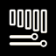 |
| Electric Bass | `electric-bass` | 17 |  |
| Acoustic Bass | `acoustic-bass` | 18 |  |
| Contrabass | `contrabass` | 19 |  |
| Les Paul Guitar | `les-paul` | 20 |  |
| Ibanez Guitar | `ibanez` | 21 |  |
| Washburn Guitar | `washburn` | 22 |  |
| Acoustic Guitar | `acoustic-guitar` | 23 |  |
| Bass Amp | `bass-amp` | 24 |  |
| Guitar Amp | `guitar-amp` | 25 |  |
| Amp Cabinet | `amp-cabinet` | 26 |  |
| Piano | `piano` | 27 | 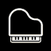 |
| Organ | `organ` | 28 |  |
| Harpsichord | `harpsichord` | 29 | 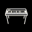 |
| Keyboard | `keyboard` | 30 | 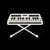 |
| Synthesizer 1 | `synthesizer-1` | 31 | 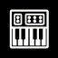 |
| Synthesizer 2 | `synthesizer-2` | 32 | 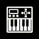 |
| Synthesizer 3 | `synthesizer-3` | 33 | 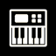 |
| Keytar | `keytar` | 34 | 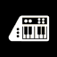 |
| Trumpet | `trumpet` | 35 |  |
| Trombone | `trombone` | 36 |  |
| Saxophone | `saxophone` | 37 |  |
| Clarinet | `clarinet` | 38 | 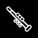 |
| Violin | `violin` | 39 |  |
| Cello | `cello` | 40 | 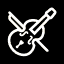 |
| Male Vocal | `male-vocal` | 41 |  |
| Female Vocal | `female-vocal` | 42 |  |
| Choir | `choir` | 43 |  |
| Hand Sign | `hand-sign` | 44 |  |
| Talk A | `talk-a` | 45 |  |
| Talk B | `talk-b` | 46 |  |
| Large Diaphragm Mic | `large-diaphragm-mic` | 47 |  |
| Condenser Mic Left | `condenser-mic-left` | 48 |  |
| Condenser Mic Right | `condenser-mic-right` | 49 | 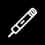 |
| Handheld Mic | `handheld-mic` | 50 |  |
| Wireless Mic | `wireless-mic` | 51 |  |
| Podium Mic | `podium-mic` | 52 |  |
| Headset Mic | `headset-mic` | 53 |  |
| XLR Jack | `xlr` | 54 |  |
| TRS Plug | `trs` | 55 |  |
| TRS Plug Left | `trs-left` | 56 | 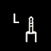 |
| TRS Plug Right | `trs-right` | 57 | 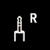 |
| RCA Plug Left | `rca-left` | 58 | 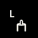 |
| RCA Plug Right | `rca-right` | 59 | 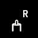 |
| Reel to Reel | `tape` | 60 |  |
| FX | `fx` | 61 |  |
| Computer | `computer` | 62 |  |
| Monitor Wedge | `wedge` | 63 |  |
| Left Speaker | `speaker-right` | 64 | 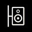 |
| Right Speaker | `speaker-left` | 65 | 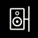 |
| Speaker Array | `speaker-array` | 66 |  |
| Speaker on a Pole | `speaker-on-pole` | 67 |  |
| Amp Rack | `amp-rack` | 68 |  |
| Controls | `controls` | 69 | 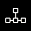 |
| Fader | `fader` | 70 | 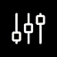 |
| MixBus | `mix-bus` | 71 |  |
| Matrix | `matrix` | 72 | 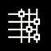 |
| Routing | `routing` | 73 |  |
| Smiley | `smiley` | 74 |  |

## Appendix B: FLOW 8 picker icons

Drawable assets from `Flowmix_v1.9.apk` (`res/drawable-*/input_icon_NNN`).
Labels marked *(validated)* were read from the Flow Mix UI on hardware (firmware v11749);
others come from `flow8_icon_mapping.json` (run `serve_flow8_mapper.py` to edit).
MS ID is set when the label matches Mixing Station ids 1–74; FLOW-only labels
(DCA, clefs, …) have no MS id. Type 6 drawables `input_icon_600`…`617` are the
last 18 picker slots.

| Label | Input type | Preset | Drawable | MS ID | MS slug | Icon |
| ----- | ---------- | ------ | -------- | ----- | ------- | ---- |
| No icon | 0 (Dynamic mic) | 0 | `input_icon_000` | 1 | `blank` |  |
| DCA | 0 (Dynamic mic) | 1 | `input_icon_001` | — | — |  |
| FX | 0 (Dynamic mic) | 2 | `input_icon_002` | 61 | `fx` |  |
| Groups | 0 (Dynamic mic) | 3 | `input_icon_003` | — | — |  |
| Wired Mic *(validated)* | 0 (Dynamic mic) | 4 | `input_icon_004` | — | — |  |
| XLR Female | 0 (Dynamic mic) | 5 | `input_icon_005` | — | — |  |
| DIN 5-pin MIDI | 0 (Dynamic mic) | 6 | `input_icon_006` | — | — |  |
| Wired Mic *(validated)* | 0 (Dynamic mic) | 7 | `input_icon_007` | — | — |  |
| TS Jack Female | 0 (Dynamic mic) | 8 | `input_icon_008` | — | — |  |
| Bass clef | 0 (Dynamic mic) | 9 | `input_icon_009` | — | — |  |
| Treble clef | 0 (Dynamic mic) | 10 | `input_icon_010` | — | — |  |
| Matrix | 0 (Dynamic mic) | 11 | `input_icon_011` | 72 | `matrix` |  |
| Routing | 0 (Dynamic mic) | 12 | `input_icon_012` | 73 | `routing` |  |
| Fader | 0 (Dynamic mic) | 13 | `input_icon_013` | 70 | `fader` |  |
| Smiley | 0 (Dynamic mic) | 14 | `input_icon_014` | 74 | `smiley` |  |
| Large Diaphragm Mic | 1 (Condenser mic) | 0 | `input_icon_100` | 47 | `large-diaphragm-mic` |  |
| Condenser Mic Left | 1 (Condenser mic) | 1 | `input_icon_101` | 48 | `condenser-mic-left` |  |
| Condenser Mic Right | 1 (Condenser mic) | 2 | `input_icon_102` | 49 | `condenser-mic-right` |  |
| Podium Mic | 1 (Condenser mic) | 3 | `input_icon_103` | 52 | `podium-mic` |  |
| Turntable | 1 (Condenser mic) | 4 | `input_icon_104` | — | — |  |
| Wireless Mic | 1 (Condenser mic) | 5 | `input_icon_105` | 51 | `wireless-mic` |  |
| Handheld Mic | 1 (Condenser mic) | 6 | `input_icon_106` | 50 | `handheld-mic` |  |
| Headset Mic | 1 (Condenser mic) | 7 | `input_icon_107` | 53 | `headset-mic` |  |
| Choir | 1 (Condenser mic) | 8 | `input_icon_108` | 43 | `choir` |  |
| Female Vocal | 1 (Condenser mic) | 9 | `input_icon_109` | 42 | `female-vocal` |  |
| Male Vocal | 1 (Condenser mic) | 10 | `input_icon_110` | 41 | `male-vocal` |  |
| Kick left | 2 (Guitar / bass) | 0 | `input_icon_200` | — | — |  |
| Kick right | 2 (Guitar / bass) | 1 | `input_icon_201` | — | — |  |
| Acoustic Guitar *(validated)* | 2 (Guitar / bass) | 2 | `input_icon_202` | — | — | 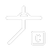 |
| Ride | 2 (Guitar / bass) | 3 | `input_icon_203` | 10 | `crash` |  |
| Snare Top | 2 (Guitar / bass) | 4 | `input_icon_204` | 4 | `snare-top` |  |
| Snare Bottom | 2 (Guitar / bass) | 5 | `input_icon_205` | 5 | `snare-bottom` |  |
| Hi-Hat | 2 (Guitar / bass) | 6 | `input_icon_206` | 9 | `hi-hat` |  |
| Drum Kit | 2 (Guitar / bass) | 7 | `input_icon_207` | 11 | `drum-kit` |  |
| Drum kit left | 2 (Guitar / bass) | 8 | `input_icon_208` | — | — |  |
| Drum kit right | 2 (Guitar / bass) | 9 | `input_icon_209` | — | — |  |
| High Tom | 2 (Guitar / bass) | 10 | `input_icon_210` | 6 | `tom-high` |  |
| Mid Tom | 2 (Guitar / bass) | 11 | `input_icon_211` | 7 | `tom-medium` |  |
| Floor Tom | 2 (Guitar / bass) | 12 | `input_icon_212` | 8 | `floor-tom` | 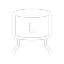 |
| Bongos | 2 (Guitar / bass) | 13 | `input_icon_213` | 13 | `bongos` |  |
| Congas | 2 (Guitar / bass) | 14 | `input_icon_214` | 14 | `congas` |  |
| Cowbell | 2 (Guitar / bass) | 15 | `input_icon_215` | 12 | `cowbell` |  |
| Tambourine | 2 (Guitar / bass) | 16 | `input_icon_216` | 15 | `tambourine` |  |
| Vibraphone | 2 (Guitar / bass) | 17 | `input_icon_217` | 16 | `vibraphone` | 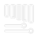 |
| Washburn Guitar | 3 (Line instrument) | 0 | `input_icon_300` | 22 | `washburn` |  |
| Hollow body electric guitar | 3 (Line instrument) | 1 | `input_icon_301` | — | — |  |
| Double bass without bow | 3 (Line instrument) | 2 | `input_icon_302` | — | — |  |
| Mandoline | 3 (Line instrument) | 3 | `input_icon_303` | — | — |  |
| Violine *(validated)* | 3 (Line instrument) | 4 | `input_icon_304` | 23 | `acoustic-guitar` |  |
| Les Paul Guitar | 3 (Line instrument) | 5 | `input_icon_305` | 20 | `les-paul` |  |
| Ibanez Guitar | 3 (Line instrument) | 6 | `input_icon_306` | 21 | `ibanez` |  |
| V shape guitar | 3 (Line instrument) | 7 | `input_icon_307` | — | — |  |
| Violin | 3 (Line instrument) | 8 | `input_icon_308` | 39 | `violin` |  |
| Electric violine without bow | 3 (Line instrument) | 9 | `input_icon_309` | — | — |  |
| Double bass with bow | 3 (Line instrument) | 10 | `input_icon_310` | — | — | 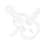 |
| Clarinet | 3 (Line instrument) | 11 | `input_icon_311` | 38 | `clarinet` |  |
| Saxophone | 3 (Line instrument) | 12 | `input_icon_312` | 37 | `saxophone` |  |
| Trombone | 3 (Line instrument) | 13 | `input_icon_313` | 36 | `trombone` |  |
| Trumpet | 3 (Line instrument) | 14 | `input_icon_314` | 35 | `trumpet` |  |
| Harpsichord | 3 (Line instrument) | 15 | `input_icon_315` | 29 | `harpsichord` |  |
| Harmonica | 3 (Line instrument) | 16 | `input_icon_316` | — | — |  |
| Accordeon | 3 (Line instrument) | 17 | `input_icon_317` | — | — |  |
| Grand piano | 4 (Guitar page (extended)) | 0 | `input_icon_400` | — | — |  |
| Upright piano | 4 (Guitar page (extended)) | 1 | `input_icon_401` | — | — |  |
| Acoustic Guitar *(validated)* | 4 (Guitar page (extended)) | 2 | `input_icon_402` | 31 | `synthesizer-1` |  |
| Synthesizer 2 | 4 (Guitar page (extended)) | 3 | `input_icon_403` | 32 | `synthesizer-2` | 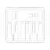 |
| Synthesizer 3 | 4 (Guitar page (extended)) | 4 | `input_icon_404` | 33 | `synthesizer-3` | 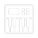 |
| Synthesizer 4 | 4 (Guitar page (extended)) | 5 | `input_icon_405` | — | — |  |
| Keytar | 4 (Guitar page (extended)) | 6 | `input_icon_406` | 34 | `keytar` | 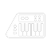 |
| Keyboard | 4 (Guitar page (extended)) | 7 | `input_icon_407` | 30 | `keyboard` |  |
| Guitar Amp | 5 (Playback / source) | 0 | `input_icon_500` | 25 | `guitar-amp` |  |
| Amp Cabinet | 5 (Playback / source) | 1 | `input_icon_501` | 26 | `amp-cabinet` |  |
| Bass Amp | 5 (Playback / source) | 2 | `input_icon_502` | 24 | `bass-amp` |  |
| Speakers | 5 (Playback / source) | 3 | `input_icon_503` | — | — |  |
| Speaker Array | 5 (Playback / source) | 4 | `input_icon_504` | 66 | `speaker-array` |  |
| Speaker | 5 (Playback / source) | 5 | `input_icon_505` | — | — |  |
| Speaker (ceiling mount) | 5 (Playback / source) | 6 | `input_icon_506` | — | — | 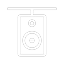 |
| Record player *(validated)* | 5 (Playback / source) | 7 | `input_icon_507` | — | — |  |
| Speaker on a Pole | 5 (Playback / source) | 8 | `input_icon_508` | 67 | `speaker-on-pole` |  |
| Monitor Wedge | 5 (Playback / source) | 9 | `input_icon_509` | 63 | `wedge` |  |
| Left Speaker | 5 (Playback / source) | 10 | `input_icon_510` | 64 | `speaker-right` |  |
| Right Speaker | 5 (Playback / source) | 11 | `input_icon_511` | 65 | `speaker-left` |  |
| Hand Sign | 6 (Music / routing) | 0 | `input_icon_600` | 44 | `hand-sign` | 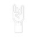 |
| TRS Plug Left | 6 (Music / routing) | 1 | `input_icon_601` | 56 | `trs-left` | 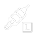 |
| TRS Plug Right | 6 (Music / routing) | 2 | `input_icon_602` | 57 | `trs-right` |  |
| TS Plug Left | 6 (Music / routing) | 3 | `input_icon_603` | — | — |  |
| TS Plug Right | 6 (Music / routing) | 4 | `input_icon_604` | — | — |  |
| In ear monitor | 6 (Music / routing) | 5 | `input_icon_605` | — | — |  |
| Headphones | 6 (Music / routing) | 6 | `input_icon_606` | — | — |  |
| Amp Rack | 6 (Music / routing) | 7 | `input_icon_607` | 68 | `amp-rack` |  |
| Computer | 6 (Music / routing) | 8 | `input_icon_608` | 62 | `computer` |  |
| Media player | 6 (Music / routing) | 9 | `input_icon_609` | — | — |  |
| Smartphone | 6 (Music / routing) | 10 | `input_icon_610` | — | — |  |
| Tablet (landscape) | 6 (Music / routing) | 11 | `input_icon_611` | — | — |  |
| Reel to Reel | 6 (Music / routing) | 12 | `input_icon_612` | 60 | `tape` |  |
| Talk A | 6 (Music / routing) | 13 | `input_icon_613` | 45 | `talk-a` | 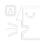 |
| Talk B | 6 (Music / routing) | 14 | `input_icon_614` | 46 | `talk-b` |  |
| Vinyl record | 6 (Music / routing) | 15 | `input_icon_615` | — | — |  |
| CD | 6 (Music / routing) | 16 | `input_icon_616` | — | — |  |
| Cassette | 6 (Music / routing) | 17 | `input_icon_617` | — | — |  |

## Appendix C: Hardware-validated preset → icon mapping

Firmware **v11749**, capture 2026-06-08. Other `(input_type, preset)` pairs must
be resolved via `getInputChannelPresetIconIdAtIndex` in the native library.

| Input type | Preset | Flow drawable | Flow UI label | MS ID | MS label |
| ---------- | ------ | ------------- | ------------- | ----- | -------- |
| 0 (Dynamic mic) | 4 | `input_icon_004` | Wired Mic | 50 | `handheld-mic` |
| 0 (Dynamic mic) | 7 | `input_icon_007` | Wired Mic | 50 | `handheld-mic` |
| 2 (Guitar / bass) | 2 | `input_icon_202` | Acoustic Guitar | 23 | `acoustic-guitar` |
| 3 (Line instrument) | 4 | `input_icon_304` | Violine | 39 | `violin` |
| 4 (Guitar page (extended)) | 2 | `input_icon_402` | Acoustic Guitar | 23 | `acoustic-guitar` |
| 5 (Playback / source) | 7 | `input_icon_507` | Record player | 60 | `tape` |

Drawable key formula: `type × 100 + preset`, zero-padded to three digits
(`input_icon_{key:03d}`).

*Maintained in `tools/flow8_icon_catalog.py` (`VALIDATED_MS_IDS`, `FLOW_UI_LABELS`).*

## Appendix D: Combined reference (by Mixing Station id)

Cross-reference of Mixing Station ids with every FLOW picker slot that resolves to
the same id. **Icon (MS)** uses the X32 BMP artwork; **Icon (FLOW)** is from the
Flow Mix APK drawable named in the FLOW drawable column.

| Label (MS) | MS slug | MS ID | Icon (MS) | FLOW drawable(s) | Icon (FLOW) |
| ---------- | ------- | ----- | --------- | ---------------- | ----------- |
| No icon | `blank` | 1 |  | `input_icon_000` |  |
| Kick Back | `kick-back` | 2 |  | — | — |
| Kick Front | `kick-front` | 3 |  | — | — |
| Snare Top | `snare-top` | 4 |  | `input_icon_204` |  |
| Snare Bottom | `snare-bottom` | 5 |  | `input_icon_205` |  |
| High Tom | `tom-high` | 6 |  | `input_icon_210` |  |
| Mid Tom | `tom-medium` | 7 |  | `input_icon_211` |  |
| Floor Tom | `floor-tom` | 8 |  | `input_icon_212` |  |
| Hi-Hat | `hi-hat` | 9 |  | `input_icon_206` |  |
| Ride | `crash` | 10 |  | `input_icon_203` |  |
| Drum Kit | `drum-kit` | 11 |  | `input_icon_207` |  |
| Cowbell | `cowbell` | 12 |  | `input_icon_215` |  |
| Bongos | `bongos` | 13 |  | `input_icon_213` |  |
| Congas | `congas` | 14 |  | `input_icon_214` |  |
| Tambourine | `tambourine` | 15 |  | `input_icon_216` |  |
| Vibraphone | `vibraphone` | 16 |  | `input_icon_217` |  |
| Electric Bass | `electric-bass` | 17 |  | — | — |
| Acoustic Bass | `acoustic-bass` | 18 |  | — | — |
| Contrabass | `contrabass` | 19 |  | — | — |
| Les Paul Guitar | `les-paul` | 20 |  | `input_icon_305` |  |
| Ibanez Guitar | `ibanez` | 21 |  | `input_icon_306` |  |
| Washburn Guitar | `washburn` | 22 |  | `input_icon_300` |  |
| Acoustic Guitar | `acoustic-guitar` | 23 |  | `input_icon_304` |  |
| Bass Amp | `bass-amp` | 24 |  | `input_icon_502` |  |
| Guitar Amp | `guitar-amp` | 25 |  | `input_icon_500` |  |
| Amp Cabinet | `amp-cabinet` | 26 |  | `input_icon_501` |  |
| Piano | `piano` | 27 |  | — | — |
| Organ | `organ` | 28 |  | — | — |
| Harpsichord | `harpsichord` | 29 |  | `input_icon_315` |  |
| Keyboard | `keyboard` | 30 |  | `input_icon_407` |  |
| Synthesizer 1 | `synthesizer-1` | 31 |  | `input_icon_402` |  |
| Synthesizer 2 | `synthesizer-2` | 32 |  | `input_icon_403` |  |
| Synthesizer 3 | `synthesizer-3` | 33 |  | `input_icon_404` |  |
| Keytar | `keytar` | 34 |  | `input_icon_406` |  |
| Trumpet | `trumpet` | 35 |  | `input_icon_314` |  |
| Trombone | `trombone` | 36 |  | `input_icon_313` |  |
| Saxophone | `saxophone` | 37 |  | `input_icon_312` |  |
| Clarinet | `clarinet` | 38 |  | `input_icon_311` |  |
| Violin | `violin` | 39 |  | `input_icon_308` |  |
| Cello | `cello` | 40 |  | — | — |
| Male Vocal | `male-vocal` | 41 |  | `input_icon_110` |  |
| Female Vocal | `female-vocal` | 42 |  | `input_icon_109` |  |
| Choir | `choir` | 43 |  | `input_icon_108` |  |
| Hand Sign | `hand-sign` | 44 |  | `input_icon_600` |  |
| Talk A | `talk-a` | 45 |  | `input_icon_613` |  |
| Talk B | `talk-b` | 46 |  | `input_icon_614` |  |
| Large Diaphragm Mic | `large-diaphragm-mic` | 47 |  | `input_icon_100` |  |
| Condenser Mic Left | `condenser-mic-left` | 48 |  | `input_icon_101` |  |
| Condenser Mic Right | `condenser-mic-right` | 49 |  | `input_icon_102` |  |
| Handheld Mic | `handheld-mic` | 50 |  | `input_icon_106` |  |
| Wireless Mic | `wireless-mic` | 51 |  | `input_icon_105` |  |
| Podium Mic | `podium-mic` | 52 |  | `input_icon_103` |  |
| Headset Mic | `headset-mic` | 53 |  | `input_icon_107` |  |
| XLR Jack | `xlr` | 54 |  | — | — |
| TRS Plug | `trs` | 55 |  | — | — |
| TRS Plug Left | `trs-left` | 56 |  | `input_icon_601` |  |
| TRS Plug Right | `trs-right` | 57 |  | `input_icon_602` |  |
| RCA Plug Left | `rca-left` | 58 |  | — | — |
| RCA Plug Right | `rca-right` | 59 |  | — | — |
| Reel to Reel | `tape` | 60 |  | `input_icon_612` |  |
| FX | `fx` | 61 |  | `input_icon_002` |  |
| Computer | `computer` | 62 |  | `input_icon_608` |  |
| Monitor Wedge | `wedge` | 63 |  | `input_icon_509` |  |
| Left Speaker | `speaker-right` | 64 |  | `input_icon_510` |  |
| Right Speaker | `speaker-left` | 65 |  | `input_icon_511` |  |
| Speaker Array | `speaker-array` | 66 |  | `input_icon_504` |  |
| Speaker on a Pole | `speaker-on-pole` | 67 |  | `input_icon_508` |  |
| Amp Rack | `amp-rack` | 68 |  | `input_icon_607` |  |
| Controls | `controls` | 69 |  | — | — |
| Fader | `fader` | 70 |  | `input_icon_013` |  |
| MixBus | `mix-bus` | 71 |  | — | — |
| Matrix | `matrix` | 72 |  | `input_icon_011` |  |
| Routing | `routing` | 73 |  | `input_icon_012` |  |
| Smiley | `smiley` | 74 |  | `input_icon_014` |  |
---

## Related documents

- [`03-bluetooth-le-protocol.md`](./03-bluetooth-le-protocol.md) — handshake, `0x37`/`0x38`
- [`04-channel-name-extraction.md`](./04-channel-name-extraction.md) — name slot layout
- [`02-sysex-dump-format.md`](./02-sysex-dump-format.md) — 7-bit packing (USB SysEx path)
