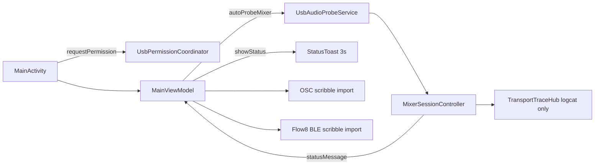
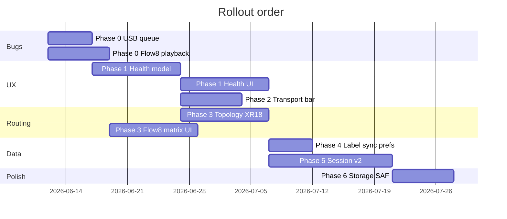

# Mixer connectivity, transport UX, routing model, and session format v2

**Status:** Architecture plan (not yet implemented)  
**Audience:** Contributors implementing the next major UX and session-format milestones  
**Related:** [xr18-routing-automation.md](xr18-routing-automation.md), [xr18-transport-latency-reduction.md](xr18-transport-latency-reduction.md), [product/session-format.md](product/session-format.md), [flow8-reverse-engineering/](flow8-reverse-engineering/)

---

## Executive summary

OpenMultiTrack already records and soundchecks reliably on XR18 and Flow 8, but connection state, permissions, and transport progress are mostly invisible to users (toasts + logcat). Several correctness gaps remain: duplicate USB permission prompts when multiple saved mixers reconnect, Flow 8 USB playback leaving the mixer in a broken state, and channel naming that does not reflect how USB capture routing differs from USB return routing.

This document proposes a phased plan that:

1. Fixes immediate bugs without destabilizing recording.
2. Introduces a **Mixer Health** model and UI that replaces ephemeral toasts for connectivity.
3. Surfaces **transport step progress** in the DAW info bar (reusing `TransportTrace`).
4. Models **per-mixer routing topology** (XR18 OSC + Flow 8 USB return matrix) so record and soundcheck can show different channel identities correctly.
5. Adopts **session format v2**: `01. Mic 1.wav` filenames and metadata embedded in WAV chunks (track marks, icon, color), retiring `.cue` sidecars.
6. Establishes **label sync policy**: OSC mixers on by default; Flow 8 BLE on-demand (not persistent connection).

Each phase is independently shippable. Later phases depend on earlier data models but not on full UI polish.

---

## Goals and non-goals

### Goals

| Area | Target outcome |
|------|----------------|
| USB permissions | Exactly one system dialog per physical device per cold start; no third prompt for an already-granted mixer |
| Connection UX | Persistent, actionable status: OSC reachable, USB attached, permission granted, capture/playback subdevice open, probe result |
| Transport UX | Info bar shows current step `n/N` during Record/Stop/Play with human-readable phases |
| Channel truth | UI labels reflect **what the file is named after** in record mode vs **what USB return receives** in soundcheck |
| Flow 8 | Correct USB return matrix; playback must not brick the mixer |
| Session files | `01. Mic 1.wav`; marks/icons/colors in WAV; no `session.cue` for new sessions |
| Label sync | XR18/X-Air OSC background refresh default-on; Flow 8 BLE import opt-in |

### Non-goals (this plan)

- Writing scribble labels back to the mixer (remain read-only).
- Full `MixerSnapshot` slot recall (still deferred; per-channel XR18 automation stays).
- RF64 / FLAC export (noted as future).
- Replacing Oboe with a new audio stack.

---

## Current architecture (baseline)



**Key classes today**

| Concern | Location |
|---------|----------|
| USB permission dedupe | `usb-audio/.../UsbPermissionCoordinator.kt` |
| Permission requests (sole caller) | `app/.../MainActivity.requestUsbPermission` |
| Probe orchestration | `MainViewModel.autoProbeMixer`, `refreshUsbAndOutputs` |
| Session transport | `MixerSessionController` + `TransportTraceHub` |
| Strip labels | `Xr18ScribbleImporter`, `Flow8BleScribbleImporter`, `Flow8UsbScribbleMapper` |
| Routing maps | `domain/.../MixerRoutingConfig.kt` (identity default) |
| XR18 OSC routing automation | `RoutingOverrideCoordinator` (Flow 8 excluded) |
| Session I/O | `PerChannelWavWriter`, `session.json`, `SessionCueFile` |
| Prerequisites banner | `DevicePrerequisites` (BT, location, mic only) |

**Pain points confirmed in code and field reports**

1. **Duplicate USB prompts** — Multiple entry points (`onCreate`, `onResume`, `onUsbPermissionGranted` → `refreshUsbAndOutputs` → `autoProbeMixer`, `_usbPermissionRequests` flow) can re-request permission for a device whose grant is keyed on a **stale `deviceName`** when `serialNumber` was unavailable before grant.
2. **Toasts** — `showStatus` + `StatusToastHost` auto-dismiss; `warningMessage` is not promoted to persistent UI.
3. **Transport trace** — Rich timing in logcat; zero UI binding.
4. **Flow 8 playback** — Generic UAC2 playback path; no Flow-8-specific teardown or routing awareness; hardware reports sine-wave lockup until power cycle.
5. **Channel naming** — `Flow8UsbScribbleMapper` maps six mixer names → ten USB capture channels; soundcheck playback assumes `outputMap` identity; Flow 8 USB return routing options from the official app are not modeled.
6. **Session format drift** — Docs mention `cues.json`; code uses `session.cue`; filenames use `channel01 - Label.wav`.

---

## Design principles

1. **Single source of truth per concern** — One `MixerHealthSnapshot` per mixer profile; UI reads snapshot, never infers from toasts.
2. **Sequential permission UX** — Queue USB permission requests across saved mixers; never `forEach { requestPermission }` without awaiting result.
3. **Stable device identity** — After first grant, persist `vid:pid:serial` (or hashed stable id); re-resolve `deviceName` on every attach without treating path change as permission loss.
4. **Mode-specific channel identity** — Separate `RecordChannelView` and `SoundcheckChannelView` derived from routing topology, not one shared label list.
5. **Fail visible** — Errors and degraded states live in the info bar until resolved or dismissed; toasts only for ephemeral success (“Saved”).
6. **Backward compatible sessions** — Readers accept v1 (`channel01.wav`, `session.cue`) and v2; writers use v2 for new sessions only.
7. **Flow 8 BLE is episodic** — Connect, read state, disconnect; never hold GATT for “connected” badge green.

---

## Phase 0 — Critical bug fixes (ship first)

**Objective:** Fix duplicate USB prompts and Flow 8 playback bricking before large UI work.

### 0.1 USB permission queue

**Root cause hypothesis (matches “XR18 → Flow 8 → XR18 again”):**

- `requestPermissionsForConnectedMixers()` iterates all saved devices and may start multiple in-flight requests.
- `onUsbPermissionGranted` calls `refreshUsbAndOutputs()` which `autoProbeMixer`s **every** profile; any profile without permission emits `_usbPermissionRequests`.
- `UsbPermissionCoordinator.stableKey()` falls back to `deviceName` when serial is unreadable pre-grant; after enumeration changes, the same physical device gets a **new key** and bypasses the 5 s grace window.
- `onResume` repeats `requestPermissionsForConnectedMixers()` while the grant flow from `onCreate` is still completing.

**Fix:**

```
New: UsbPermissionQueue (app module)
  - enqueue(device stable id)
  - process one at a time; on grant/deny → next
  - expose StateFlow<UsbPermissionQueueState> for UI

MainActivity:
  - requestPermissionsForConnectedMixers → queue.enqueueAll(connected saved devices)
  - remove direct forEach requestPermission

MainViewModel.onUsbPermissionGranted:
  - update profile.usbStableId + usbDeviceName
  - autoProbe only the granted device’s profile (not all mixers)
  - schedule refreshUsbAndOutputs debounced 300ms (coalesce)

UsbPermissionCoordinator:
  - after grant, map deviceName → stableKey in a side table
  - shouldRequest: if any known alias of stable id has permission → false

UsbAudioEnumerator.hasUsbPermissionForProfile:
  - match by vid+pid+serial first; ignore stale usbDeviceName
```

**Acceptance:** Cold start with XR18 + Flow 8 connected after clearing “open by default”: **≤2** system dialogs, never a third for XR18. E2E: `UsbPermissionQueueTest` + manual script in `docs/development/testing.md`.

### 0.2 Flow 8 USB playback stability

**Symptoms:** Soundcheck playback from the app leaves Flow 8 outputting a sine-like tone until full power cycle. Recording multitrack and Linux host playback do not reproduce.

**Investigation checklist:**

| Check | Rationale |
|-------|-----------|
| Compare capture vs playback UAC2 alt settings | Wrong alt may leave DSP in test mode |
| Ensure `prepareUsbForPlaybackLocked` fully stops capture and releases UAC2 capture interface before playback claim | Shared interface contention |
| Verify playback channel count (10ch vs 2ch stereo) against Flow 8 descriptor | Oversized stream may confuse firmware |
| Log sample rate / format at `NativeUac2Engine.startPlayback` vs Linux `aplay -D` | Format mismatch |
| Teardown: `stopPlayback` → release interface → delay before re-open capture | Incomplete teardown |

**Implementation sketch:**

```
mixer-behringer: Flow8UsbPlaybackProfile
  - preferredPlaybackChannels = 2 (USB 1/2 returns only by default)
  - requiresCaptureReleaseBeforePlayback = true
  - postStopPlaybackDelayMs = 100

MixerSessionController.ensurePlaybackLocked:
  - if Flow8: apply profile constraints
  - hard cap playback to 2 unless user enables “multi-return soundcheck”

AudioEngineRouter.startPlayback:
  - Flow8: force selectBestPlaybackAlt(..., 2, 48000) first

Add: Flow8HardwarePlaybackTeardownTest (instrumented, gated)
```

**Acceptance:** 10× play/stop soundcheck cycles without mixer lockup; USB disconnect/reconnect without power cycle.

### 0.3 Soundcheck routing peekApply latency (quick win)

Documented in [xr18-transport-latency-reduction.md](xr18-transport-latency-reduction.md): soundcheck still full-applies OSC routing before USB (~2.8 s). Fix `peekApply` so unchanged targets skip burst write. Independent of UX work but unblocks acceptable Play responsiveness.

---

## Phase 1 — Mixer Health model and connection UI

**Objective:** Replace connection toasts with durable, actionable status.

### 1.1 Domain model

```kotlin
// domain/.../MixerHealth.kt

enum class HealthLevel { OK, DEGRADED, BLOCKED, UNKNOWN }

data class MixerHealthSnapshot(
    val mixerId: String,
    val updatedAtMs: Long,
    val overall: HealthLevel,
    val osc: OscHealth?,           // null if mixer has no OSC
    val usb: UsbHealth,
    val audio: AudioSubdeviceHealth,
    val permissions: MixerPermissionHealth,
    val labels: LabelSyncHealth,
    val issues: List<HealthIssue>, // sorted by severity
)

data class OscHealth(
    val host: String?,
    val reachable: Boolean,
    val lastPingMs: Long?,
    val latencyMs: Int?,
)

data class UsbHealth(
    val attached: Boolean,
    val deviceName: String?,
    val stableId: String?,
    val permissionGranted: Boolean,
    val probeState: ProbeState,    // NONE | PROBING | OK | FAILED
    val probeSummary: String?,     // "10 in / 10 out @ 48 kHz UAC2"
)

data class AudioSubdeviceHealth(
    val captureOpen: Boolean,
    val captureChannels: Int,
    val playbackOpen: Boolean,
    val playbackChannels: Int,
    val backend: String?,          // OBOE | UAC2
)

data class HealthIssue(
    val code: String,
    val severity: HealthLevel,
    val title: String,
    val detail: String,
    val action: HealthAction?,     // OPEN_USB_PERMISSION, OPEN_MIXER_HEALTH, REQUEST_BT, ...
)
```

**Producer:** `MixerHealthCollector` (app module) subscribes to:

- `UsbAudioEnumerator` device list
- `UsbPermissionCoordinator` / queue state
- `MixerSessionController.state` (probe, `isUsbDegraded`, stream handles)
- `OscLanDiscovery` / last successful scribble host
- `DevicePrerequisites` + notification/storage permission helpers

Refresh on: USB attach/detach, permission result, probe complete, transport start/stop, manual refresh.

### 1.2 UI surfaces

**A. Mixer Health screen** (new destination from mixer menu + issue actions)

| Section | Rows |
|---------|------|
| Overview | Overall badge, active mode, last refresh |
| Network (OSC) | Host, reachability, round-trip, “Test connection” |
| USB | Attached, permission, stable id, probe summary |
| Audio | Capture open/closed, playback open/closed, backend |
| Labels | Last sync time, source (OSC/BLE/cache), “Sync now” |
| App permissions | Notifications, Bluetooth, location (with explanation), microphone, storage scope |

Row pattern: status icon + label + detail + action button (Grant, Open settings, Sync, Diagnose).

**B. Info bar** (below top button bar in `DawMainScreen`)

Priority stack (highest first):

1. Active transport progress (Phase 2)
2. `HealthIssue` with severity ≥ DEGRADED for active mixer
3. `session.warningMessage` (existing)
4. Collapsed OK summary: “XR18 — USB ready · OSC connected”

Tap info bar → Mixer Health screen filtered to active mixer.

**C. Toasts — reduced role**

Keep toasts for: short success confirmations, non-blocking hints during first-run tour. Remove USB/permission/recovery messages that are now in the info bar.

### 1.3 Flow 8 Bluetooth policy in Health UI

Display BLE as **“Available for label sync”**, not **“Connected”**.

| State | Display |
|-------|---------|
| Idle | “Label sync: off (tap to sync)” |
| Syncing | “Reading mixer names…” |
| Success | “Labels updated 2 min ago” |
| Blocked | “Bluetooth permission required” |

**Settings default:** `flow8AutoLabelSync = false`, `oscAutoLabelSync = true` (new `LabelSyncPreferences`).

BLE session: open GATT → handshake → `GetMixerState` + ParamQuery `0x80` → disconnect in `finally`. Document that persistent connection blocks the official Flow 8 app.

---

## Phase 2 — Transport progress in info bar

**Objective:** User sees `Step 3/12 — Applying input routing (CH1→USB)` during Record/Stop/Play.

### 2.1 Extend TransportTrace for UI

```kotlin
data class TransportStep(
    val index: Int,
    val total: Int?,              // null until known
    val phase: String,            // machine key
    val label: String,            // human string
    val startedAtMs: Long,
    val completed: Boolean,
)

object TransportTraceHub {
    val steps: StateFlow<Map<String, List<TransportStep>>>  // per mixerId
    fun mark(mixerId, phase, label = phase.toUserLabel())
}
```

Wire existing marks in `MixerSessionController`, `RoutingOverrideCoordinator`, `MainViewModel` — no duplicate instrumentation.

**Predefined step templates** per transport:

| Transport | Example steps |
|-----------|----------------|
| RECORD-START | Promote foreground → USB permission check → Quiesce USB → OSC read routing → OSC apply routing → Open WAV writers → Start capture |
| RECORD-STOP | Stop capture → Flush WAV → Restore routing → Refresh library |
| SOUNDCHECK-PLAY | Load session → Quiesce/monitor → OSC routing → Open playback → Start player |

UI: `TransportProgressBar` in info bar with spinner, step label, optional determinate progress when `total` known.

All steps already logged via `OmtLog`; also append to `AppLogBuffer` under `Transport` category for in-app log viewer.

---

## Phase 3 — Routing topology and channel identity

**Objective:** Correct channel names, input-source badges, and record vs soundcheck display.

### 3.1 Conceptual model

Three parallel channel spaces:

```
┌─────────────────┐     ┌──────────────────┐     ┌─────────────────┐
│ Physical inputs │     │ USB capture bus  │     │ USB playback bus│
│ (mic pres, etc.)│ ──► │ (what we record) │     │ (what we play to)│
└─────────────────┘     └──────────────────┘     └─────────────────┘
         │                        │                        │
         └──────── Mixer routing matrix (model-specific) ───┘
```

For each logical strip `n`, maintain:

| Field | Record mode | Soundcheck mode |
|-------|-------------|-----------------|
| `captureUsbIndex` | USB input index in WAV | N/A (file already exists) |
| `playbackUsbIndex` | N/A | USB return index |
| `displayName` | From capture path label | From playback path label |
| `fileBaseName` | `01. Mic 1` | Uses record-time name from `session.json` |
| `inputSource` | A/D, USB, etc. | Same badge if relevant |

When capture and playback paths differ, **UI must show different names per mode** (user expectation from this request).

### 3.2 XR18 (OSC-capable)

**Already have:** `Xr18ScribbleImporter` reads `/ch/NN/config/name` and `/routing/usb/NN/src`.

**Extend:**

- `Xr18ChannelTopologyReader` returns per-channel: `insrc`, `rtnsw`, `rtnsrc`, USB return mapping, scribble name/color/icon.
- Input source badge on strip: `A/D`, `USB`, `AES`, etc. from `insrc`.
- Soundcheck: display name from return path (`rtnsrc` → physical channel name).
- Record: display name from capture path (USB bus name or routed preamp channel).

Persist last topology snapshot in `ScribbleStripCache` fingerprint for offline display.

### 3.3 Flow 8 (USB + BLE, no LAN OSC)

**Recording truth** (from `Flow8UsbScribbleMapper` + hardware validation):

| USB capture ch | Default source | Notes |
|----------------|----------------|-------|
| 1–4 | Ch 1–4 | Mono strips |
| 5–6 | Ch 5/6 stereo pair | One scribble name |
| 7–8 | Ch 7/8 stereo pair | One scribble name |
| 9–10 | Main L / Main R | **Not** “USB BT stereo” — recording uses mains |

**Playback / USB return matrix** (from official app — must be read or configured):

| USB return | Default route | Official alternatives |
|------------|---------------|------------------------|
| USB 1/2 | Internal stereo USB/BT channel | → Main L/R **or** → Ch 5/6 |
| USB 3/4 | Nowhere | → Main L/R **or** → Ch 7/8 |
| Monitor out | None | USB 1/2, USB 3/4, or neither → Mon Out 1/2 |

**Implementation path:**

1. **Short term (config UI):** `Flow8RoutingPreferences` mirrors the three official toggles; defaults match factory routing. Soundcheck uses this to map playback USB index → mixer channel name shown on strip.
2. **Medium term (read from mixer):** Reverse-engineer USB MIDI SysEx or BLE params for routing state (see [flow8-reverse-engineering/](flow8-reverse-engineering/)); prefer USB SysEx when cable connected to avoid BLE.

**Soundcheck default:** Play to USB 1/2 only (stereo mix or per-channel per `MixerRoutingConfig.outputMap`) until multi-return is explicitly enabled — aligns with Phase 0.2 safety.

### 3.4 `MixerRoutingConfig` evolution

```kotlin
data class MixerRoutingConfig(
    val inputMap: Map<Int, Int> = emptyMap(),
    val outputMap: Map<Int, Int> = emptyMap(),
    val hiddenRecord: Set<Int> = emptySet(),
    val hiddenSoundcheck: Set<Int> = emptySet(),
    // new:
    val flow8UsbReturnMatrix: Flow8UsbReturnMatrix? = null,
    val recordDisplayNames: Map<Int, String> = emptyMap(),    // override cache
    val soundcheckDisplayNames: Map<Int, String> = emptyMap(),
)
```

`ChannelStripUiModel` gains: `inputSourceBadge`, `recordLabel`, `soundcheckLabel`, `modeLabel` (computed from `AppMode`).

### 3.5 Input source badge UI

Small chip on channel strip header (record + soundcheck): `A/D`, `USB`, `LINE`, etc. Tap → channel settings sheet showing full routing path read-only (+ link to Mixer Health / routing doc).

---

## Phase 4 — Label sync policy

| Mixer type | Default | Mechanism | Connection style |
|------------|---------|-----------|------------------|
| XR18, X32, X-Air OSC | On | `Xr18ScribbleImporter` | Background when fingerprint changes; no user dialog |
| Flow 8 | Off | `Flow8BleScribbleImporter` | On-demand button; pairing mode scan; **disconnect after read** |
| Flow 8 (future) | Opt-in | USB SysEx dump | When stable USB MIDI implemented |

**Settings:**

- `oscAutoLabelSync` (default true)
- `flow8AutoLabelSync` (default false)
- `labelSyncIntervalMin` for OSC (default 15)

**Mixer Health** shows last sync + trigger button. Auto OSC sync respects `canAutoImportScribble` gating (not during record/playback).

---

## Phase 5 — Session format v2 (WAV-embedded metadata)

**Objective:** Files named `01. Mic 1.wav`; track marks, icon, and color stored in WAV; remove `.cue` for new sessions.

### 5.1 Filename rules

```kotlin
object ChannelFileNaming {
    fun fileName(index: Int, label: String?): String {
        val num = "%02d".format(index + 1)
        val safe = label?.let { sanitizeFileName(it) }?.takeIf { it.isNotEmpty() }
        return if (safe != null) "$num. $safe.wav" else "$num.wav"
    }
}
```

Sanitization: strip `/\:*?"<>|`, collapse whitespace, max 64 chars. Collision handling: append ` (2)` if needed.

**`session.json` v2** adds:

```json
{
  "formatVersion": 2,
  "channels": [{
    "index": 0,
    "fileName": "01. Mic 1.wav",
    "displayName": "Mic 1",
    "colorArgb": -12345,
    "iconId": 12,
    "captureUsbIndex": 0,
    "inputSource": "AD"
  }],
  "trackmarks": [...]
}
```

Trackmarks move from sidecar into JSON **and** redundant WAV metadata (see below).

### 5.2 WAV metadata strategy

Use standard and extensible chunks:

| Chunk | Content |
|-------|---------|
| `bext` (Broadcast WAV) | Description = channel label; Origination time; Coding history optional |
| `LIST/INFO` | `INAM` title, `ISFT` OpenMultiTrack version |
| Custom `omt ` chunk (private) | JSON: `{ "v":1, "iconId", "colorArgb", "trackmarks":[...], "captureUsbIndex", "inputSource" }` |

**Rationale:** Custom chunk carries app-specific data; `bext` + `LIST` give partial interoperability with external tools. Track marks duplicated in every channel file per user request (small JSON blob).

**Module changes:** `session-io`

- `WavMetadataWriter` / `WavMetadataReader`
- `PerChannelWavWriter` writes chunks on finalize (after audio data)
- `SessionMigrator` for v1 → v2 on load (optional background migration)

### 5.3 Deprecate `session.cue`

| Action | Detail |
|--------|--------|
| New sessions | Do not write `session.cue` |
| Read path | If `formatVersion < 2` and `session.cue` exists, import marks into memory; show once in UI |
| Write path | Save marks to `session.json` + WAV chunks only |
| Settings | Remove `chapterSupportEnabled` cue toggle; replace with “Track marks” (on by default) |
| Tests | Port `SessionCueFileTest` scenarios to WAV metadata tests; keep cue reader for legacy |

### 5.4 Soundcheck file resolution

Soundcheck always uses **record-time** `fileName` + `displayName` from `session.json` (what was captured), regardless of current playback routing labels. Playback routing only affects monitoring path, not file identity.

---

## Phase 6 — Permissions and storage best practices

### 6.1 Unified permissions section in Mixer Health

| Permission | Why | UX |
|------------|-----|-----|
| USB device | Access mixer | System dialog via queue |
| Record audio | Android USB audio policy | Standard request |
| Bluetooth | Flow 8 label sync | Explain: not required for audio |
| Location | BLE scan on older API | Explain: not used for tracking |
| Notifications | Background record control | Optional but recommended |
| Storage | Session write path | **Scoped first** |

### 6.2 Storage strategy

1. **Default:** `ACTION_OPEN_DOCUMENT_TREE` — user picks session root; persist URI permission.
2. **Optional:** “Grant full storage access” for users who want traditional file managers (existing `StorageAccessHelper` path).
3. **Recording path resolver:** Prefer SAF tree; fall back to app-specific external dir without extra permission.

Info bar issue if session path not writable: “Choose recording folder” → Storage section in Mixer Health.

---

## Implementation phases and dependencies



| Phase | Can ship independently | Depends on |
|-------|------------------------|------------|
| 0 | Yes | — |
| 1 | Yes | 0.1 recommended |
| 2 | Yes | 1 (info bar slot) |
| 3 | Partial per mixer | 1 (Health for routing issues) |
| 4 | Yes | 1 |
| 5 | Yes (with migration) | 3 for full metadata |
| 6 | Yes | 1 |

---

## Testing strategy

### Automated

| Area | Test type |
|------|-----------|
| USB permission queue | JVM unit + `UsbPermissionCoordinatorTest` extensions |
| MixerHealthCollector | JVM with fake enumerators |
| Transport step mapping | JVM |
| WAV metadata round-trip | `session-io` unit |
| Filename sanitization | JVM |
| XR18 topology reader | JVM with mocked OSC responses |
| Flow 8 playback teardown | Instrumented, hardware-gated |
| Session v1 compatibility | Load golden v1 fixture, assert playback |

### Manual scripts

Document in `docs/development/testing.md`:

1. **Dual-mixer permission:** XR18 + Flow 8, clear default handler, cold start — count dialogs.
2. **Flow 8 playback stress:** 10× play/stop, power-no-cycle check.
3. **Record → soundcheck label:** CH1 USB, CH2 A/D — verify strip badges and filenames.
4. **Session v2:** Record 2 channels with marks; inspect WAV chunks with `ffprobe`/hex.

### E2E extension

Extend `scripts/run-xr18-routing-e2e.sh` with optional `--health-assert` for health snapshot JSON export (debug build hook).

---

## Risk register

| Risk | Mitigation |
|------|------------|
| Flow 8 routing SysEx not available | Config UI defaults + BLE read later |
| WAV custom chunk breaks external tools | Keep standard PCM; custom chunk optional to readers |
| Health collector performance | Coalesce updates; avoid main-thread USB IO |
| Migration breaks old sessions | `formatVersion` gate; v1 reader forever |
| BLE auto-sync angers users | Default off for Flow 8 |
| Scoped storage confuses power users | Explicit “full access” optional button |

---

## Documentation updates required

| Doc | Change |
|-----|--------|
| [product/session-format.md](product/session-format.md) | v2 layout, WAV chunks, drop cue as primary |
| [PROJECT_STATUS.md](PROJECT_STATUS.md) | Mixer Health UI, session v2, Flow 8 playback fix |
| [product/ui-daw.md](product/ui-daw.md) | Info bar, Health screen, transport progress |
| [modules/usb-audio.md](modules/usb-audio.md) | Permission queue, stable id |
| [hardware-assumptions.md](hardware-assumptions.md) | Flow 8 return matrix defaults, playback 2ch |
| [architecture/decisions.md](architecture/decisions.md) | ADR: session v2 metadata, Health snapshot |

---

## Open questions (resolve during implementation)

1. **Flow 8 routing read path:** USB SysEx vs BLE parameter query — which is stable on firmware v11749+?
2. **WAV mark redundancy limit:** Cap track mark count per file or unlimited?
3. **Multi-mixer active session:** Does Health show all saved mixers or only active + connected?
4. **Remote client:** Mirror Health snapshot over LAN protocol (`health_snapshot` message)?
5. **Icon in WAV:** Store Mixing Station icon ID only, or rasterize for external tools?

---

## Summary checklist for contributors

- [ ] Phase 0.1: USB permission queue + stable id — no duplicate XR18 prompt
- [ ] Phase 0.2: Flow 8 playback teardown — no sine-wave brick
- [ ] Phase 1: `MixerHealthSnapshot` + Health screen + info bar issues
- [ ] Phase 2: `TransportStep` UI bound to `TransportTraceHub`
- [ ] Phase 3: Record vs soundcheck channel labels + input source badges
- [ ] Phase 3: Flow 8 USB return matrix settings
- [ ] Phase 4: OSC auto-sync on, Flow 8 auto-sync off
- [ ] Phase 5: `01. Mic 1.wav` + WAV metadata + retire new `.cue`
- [ ] Phase 6: SAF default storage + full access optional

This plan intentionally sequences **bugs first**, then **visibility** (Health + transport), then **correctness** (routing topology), then **on-disk format** — so users see improvement early without waiting for the full session v2 migration.
