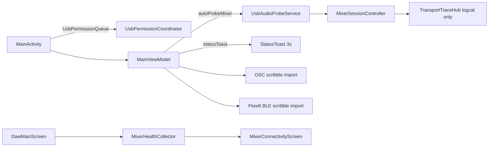
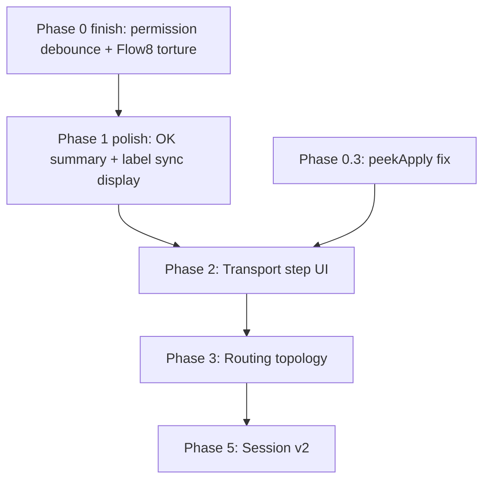

# Mixer connectivity, transport UX, routing model, and session format v2

**Status:** Living plan — partially implemented (updated 2026-06-11)  
**Audience:** Contributors implementing the next major UX and session-format milestones  
**Related:** [xr18-routing-automation.md](xr18-routing-automation.md), [xr18-transport-latency-reduction.md](xr18-transport-latency-reduction.md), [product/session-format.md](product/session-format.md), [flow8-reverse-engineering/](flow8-reverse-engineering/)

---

## Executive summary

OpenMultiTrack records and soundchecks reliably on XR18 and Flow 8. Recent work added routing automation settings, transport activity feedback in the info bar, and a `MixerHealthSnapshot` model. The **Mixer connectivity** screen is the current UX milestone.

This document sequences remaining work:

1. **Finish Phase 0** — USB permission hardening and Flow 8 playback torture tests.
2. **Phase 1 (in progress)** — Mixer Health model + connectivity UI + info-bar issues.
3. **Phase 2** — Transport step progress in the info bar (no USB quiesce).
4. **Phases 3–6** — Routing topology, label sync policy, session format v2, storage polish.

Each phase is independently shippable.

---

## Implementation status (2026-06-11)

| Area | Status | Notes |
|------|--------|-------|
| USB permission queue | **Done** | `UsbPermissionQueue` in `usb-audio`; `MainActivity` drains one device at a time |
| Stable USB device id | **Done** | `UsbPermissionCoordinator.stableKeyForParts()`; grant debounce probes only granted mixer |
| Flow 8 playback profile | **Done** | `Flow8UsbPlaybackProfile` — 2/4ch playback, capture release before play, post-stop delays |
| Flow 8 torture test | **Open** | Instrumented 10× play/stop gate not yet in CI |
| USB quiesce before OSC | **Removed (obsolete)** | Was ~5 s monitor/capture teardown misattributed as “needed for OSC”; OSC works while USB streams |
| Routing automation UI | **Done** | Per-mixer LAN routing in mixer settings; restore policy (`NONE` / recall snapshot / slot) |
| Transport activity info bar | **Done** | `SessionActivityStatus` with spinner/progress during record/play/load |
| `MixerHealthSnapshot` | **Done** | USB, OSC, audio transport, issues in `domain/.../MixerHealth.kt` |
| `MixerHealthCollector` | **Done** | Populates snapshot from session + USB enumerator |
| Mixer connectivity screen | **Done** | `MixerConnectivityScreen` — drawer + tap info bar |
| Transport step UI (`n/N`) | **Open** | `TransportTraceHub` still logcat-only |
| Session format v2 | **Open** | `01. Mic 1.wav`, WAV metadata, retire new `.cue` |
| Flow 8 USB return matrix UI | **Open** | Config mirrors official app toggles |
| Label sync prefs | **Open** | OSC auto on, Flow 8 BLE on-demand |

---

## Obsolete / rejected approaches

### USB quiesce before OSC routing — **do not reintroduce**

Earlier code called `quiesceUsbBeforeRoutingLocked()` before every OSC apply: stop monitor, VU, capture, playback, then route. Field timing showed **~5 s** on that step when monitor was active. That delay was **monitor/capture teardown**, not an OSC requirement. X-Air desks accept OSC while USB audio is active.

**Policy:** Apply OSC routing while USB capture/playback continues. Keep Flow 8 **capture-release-before-playback** (`prepareFlow8UsbForPlaybackLocked`) — that is interface contention on Flow 8, not an OSC rule.

### Full `MixerSnapshot` slot recall on transport

Still deferred. Per-channel XR18 automation + optional snapshot recall on restore is the model.

---

## Goals and non-goals

### Goals

| Area | Target outcome |
|------|----------------|
| USB permissions | Exactly one system dialog per physical device per cold start; no third prompt for an already-granted mixer |
| Connection UX | Persistent, actionable status: OSC host, USB attached, permission, probe, audio transport |
| Transport UX | Info bar shows current step `n/N` during Record/Stop/Play |
| Channel truth | UI labels reflect capture path (record) vs USB return path (soundcheck) |
| Flow 8 | Correct USB return matrix; playback must not brick the mixer |
| Session files | `01. Mic 1.wav`; marks/icons/colors in WAV; no `session.cue` for new sessions |
| Label sync | XR18/X-Air OSC background refresh default-on; Flow 8 BLE import opt-in |

### Non-goals (this plan)

- Writing scribble labels back to the mixer (read-only).
- Full `MixerSnapshot` slot recall on every transport (deferred).
- RF64 / FLAC export.
- Replacing Oboe with a new audio stack.
- Stopping USB audio before OSC commands.

---

## Current architecture (baseline)


```mermaid
flowchart LR
    MA[MainActivity] -->|UsbPermissionQueue| USB[UsbPermissionCoordinator]
    MA --> VM[MainViewModel]
    VM -->|autoProbeMixer| Probe[UsbAudioProbeService]
    Probe --> MSC[MixerSessionController]
    VM -->|statusToast| Toast[StatusToast 3s]
    MSC --> Trace[TransportTraceHub logcat only]
    VM --> OSC[OSC scribble import]
    VM --> BLE[Flow8 BLE scribble import]
    DMS[DawMainScreen] --> MHC[MixerHealthCollector]
    MHC --> MCS[MixerConnectivityScreen]
```

**Key classes**

| Concern | Location |
|---------|----------|
| USB permission queue | `usb-audio/.../UsbPermissionQueue.kt` |
| Permission requests | `app/.../MainActivity.requestUsbPermission` |
| Session transport | `MixerSessionController` + `TransportTraceHub` |
| Health snapshot | `domain/.../MixerHealth.kt`, `app/.../health/MixerHealthCollector.kt` |
| Connectivity UI | `app/.../ui/daw/MixerConnectivityScreen.kt` |
| Activity info bar | `SessionActivityStatus`, `RecordSessionInfoBar`, `SoundcheckSessionInfoBar` |
| XR18 OSC routing | `RoutingOverrideCoordinator` |
| Flow 8 playback safety | `Flow8UsbPlaybackProfile` |

---

## Design principles

1. **Single source of truth** — `MixerHealthSnapshot` per active mixer; UI reads snapshot, not toasts.
2. **Sequential USB permission UX** — Queue requests; never parallel `forEach { requestPermission }`.
3. **Stable device identity** — `vid:pid:serial`; re-resolve `deviceName` on attach without treating path change as permission loss.
4. **OSC does not require USB silence** — Route while streaming; optimize latency via pre-apply on arm/session select.
5. **Mode-specific channel identity** — Separate record vs soundcheck display from routing topology.
6. **Fail visible** — Issues in info bar until resolved; toasts for ephemeral success only.
7. **Backward compatible sessions** — Readers accept v1; writers use v2 for new sessions only.
8. **Flow 8 BLE is episodic** — Connect, read, disconnect; never hold GATT for a “connected” badge.

---

## Phase 0 — Critical bug fixes

**Objective:** Harden USB permissions and Flow 8 playback before larger format work.

### 0.1 USB permission queue — **mostly done**

**Implemented:** `UsbPermissionQueue`, sequential drain in `MainActivity`, `stableKey()` in coordinator.

**Remaining:**

- Manual dual-mixer script in `docs/development/testing.md` (hardware).

**Implemented:** `UsbPermissionQueue`, sequential drain in `MainActivity`, `stableKeyForParts()`, grant debounce (300 ms), `onUsbPermissionGranted` probes only the granted mixer profile(s), `UsbPermissionQueueTest` + `UsbPermissionCoordinatorStableKeyTest`.

**Acceptance:** Cold start with XR18 + Flow 8: **≤2** system dialogs, never a third for XR18.

### 0.2 Flow 8 USB playback stability — **profile done, validation open**

**Implemented:** `Flow8UsbPlaybackProfile` — preferred 2/4ch playback, capture release before playback, post-stop delays, stereo instrumented test.

**Remaining:** 10× play/stop soundcheck torture on hardware; confirm no sine-wave lockup without power cycle.

### 0.3 Soundcheck routing `peekApply` latency — **open**

Documented in [xr18-transport-latency-reduction.md](xr18-transport-latency-reduction.md): soundcheck must not full-apply OSC before USB when `peekApply` should be capture-only. Independent quick win for Play responsiveness.

---

## Phase 1 — Mixer Health and connectivity UI — **in progress**

### 1.1 Domain model — **done**

```kotlin
data class MixerHealthSnapshot(
    val mixerId: String,
    val updatedAtMs: Long,
    val overall: HealthLevel,
    val usb: UsbHealth,
    val osc: OscHealth?,              // null when mixer has no OSC
    val audio: AudioTransportHealth?, // capture/playback/monitor/degraded
    val issues: List<HealthIssue>,
)
```

Producer: `MixerHealthCollector.collect()` from USB enumerator, session state, OSC support flag.

### 1.2 UI surfaces

**A. Mixer connectivity screen — done**

Sections: Overview, USB, LAN/OSC, Audio transport, Issues, App permissions. Open from navigation drawer (“Mixer connectivity”) or tap session info bar.

**B. Info bar — partial**

- Activity status during transport: **done**
- Health issues when no activity: **done**
- Collapsed OK summary (“USB ready · OSC configured”): **open**
- Tap → connectivity screen: **done**

**C. Toasts — partial**

Routing/permission errors should migrate from toasts to health issues over time.

### 1.3 Flow 8 Bluetooth in Health UI — **open**

Display BLE as “Available for label sync”, not “Connected”. Settings: `flow8AutoLabelSync = false`, `oscAutoLabelSync = true`.

---

## Phase 2 — Transport progress in info bar

**Objective:** User sees `Step 3/12 — Applying input routing` during Record/Stop/Play.

Extend `TransportTraceHub` with `StateFlow` steps; bind to info bar. **Do not** include “Quiesce USB” in step templates — that step is removed.

Example record-start steps:

1. Promote foreground
2. USB permission check
3. OSC apply routing (while USB may already be streaming)
4. Open WAV writers
5. Start capture

---

## Phase 3 — Routing topology and channel identity

Unchanged intent: record vs soundcheck channel names, input source badges, Flow 8 USB return matrix config. See prior sections in git history for full model; implementation still open.

---

## Phase 4 — Label sync policy

| Mixer type | Default | Mechanism |
|------------|---------|-----------|
| XR18, X32, X-Air OSC | On | `Xr18ScribbleImporter` background |
| Flow 8 | Off | `Flow8BleScribbleImporter` on-demand |

---

## Phase 5 — Session format v2

`01. Mic 1.wav`; track marks in WAV `omt ` chunk + `session.json` v2; stop writing `session.cue` for new sessions. See prior plan body for chunk layout.

---

## Phase 6 — Permissions and storage

Unified permissions in connectivity screen (partial — prerequisites section exists). SAF default storage path still open.

---

## Rollout order (revised)


```mermaid
flowchart TD
    P0[Phase 0 finish: permission debounce + Flow8 torture]
    P1[Phase 1 polish: OK summary + label sync display]
    P2[Phase 2: Transport step UI]
    P03[Phase 0.3: peekApply fix]
    P3[Phase 3: Routing topology]
    P5[Phase 5: Session v2]
    P0 --> P1
    P1 --> P2
    P03 --> P2
    P2 --> P3
    P3 --> P5
```

| Phase | Can ship independently | Depends on |
|-------|------------------------|------------|
| 0 (remainder) | Yes | — |
| 1 (remainder) | Yes | 0.1 recommended |
| 2 | Yes | 1 info bar slot |
| 3 | Partial per mixer | 1 |
| 4–6 | Yes | 1 / 3 as noted |

---

## Testing strategy

| Area | Test type | Status |
|------|-----------|--------|
| USB permission queue | JVM `UsbPermissionQueueTest` | Open |
| MixerHealthCollector | JVM | **Done** |
| Connectivity screen | Manual / screenshot | New |
| Flow 8 playback teardown | Instrumented, hardware-gated | Partial |
| Transport step mapping | JVM | Open |
| Session v1 compatibility | Golden fixture | Open |

Manual scripts in `docs/development/testing.md`: dual-mixer permission count, Flow 8 10× play/stop, record → soundcheck labels.

---

## Summary checklist for contributors

- [x] Remove USB quiesce before OSC routing
- [x] `UsbPermissionQueue` sequential requests
- [x] `Flow8UsbPlaybackProfile` playback constraints
- [x] `MixerHealthSnapshot` + `MixerHealthCollector`
- [x] Mixer connectivity screen + info bar navigation
- [x] Transport activity status in info bar
- [x] Per-mixer routing automation settings + restore policy
- [x] Phase 0.1: grant debounce + queue tests — probe only granted mixer on grant
- [ ] Phase 0.2: Flow 8 10× play/stop torture — no brick
- [ ] Phase 0.3: soundcheck `peekApply` capture-only fix
- [ ] Phase 1: collapsed OK summary in info bar; reduce permission toasts
- [ ] Phase 2: `TransportStep` UI bound to `TransportTraceHub`
- [ ] Phase 3: Record vs soundcheck channel labels + input source badges
- [ ] Phase 3: Flow 8 USB return matrix settings
- [ ] Phase 4: OSC auto-sync on, Flow 8 auto-sync off
- [ ] Phase 5: `01. Mic 1.wav` + WAV metadata + retire new `.cue`
- [ ] Phase 6: SAF default storage + full access optional

This plan sequences **remaining bugs**, then **visibility polish**, then **routing correctness**, then **on-disk format** — without reintroducing USB quiesce or blocking OSC on active USB streams.
